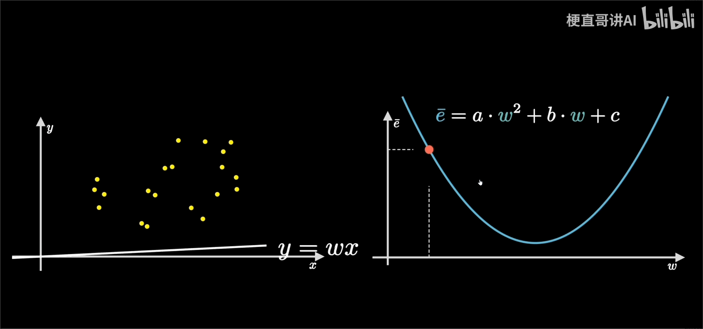
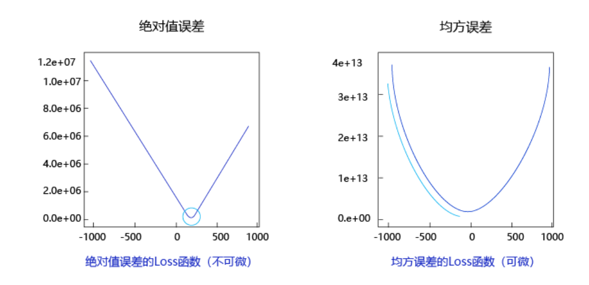

# 一、人工智能、机器学习、深度学习的关系

**人工智能（ArtificialIntelligence，AI）** 是研发用于模拟、延伸和扩展人的智能的理论、方法、技术及应用系统的一门新的技术科学。它只阐述了目标，而没有限定方法，因此实现人工智能存在的诸多方法和分支。

**机器学习（MachineLearning，ML）** 是当前比较有效的一种实现人工智能的方式。

**深度学习（DeepLearning，DL）** 是机器学习算法中最热门的一个分支，近些年取得了显著的进展，并替代了大多数传统机器学习算法。

## 1.1 机器学习

### 机器学习

是专门研究计算机怎样模拟或实现人类的学习行为，以获取新的知识或技能，重新组织已有的知识结构，使之不断改善自身的性能。

### 机器学习的实现

**归纳：** 从具体案例中抽象一般规律，机器学习中的“训练”亦是如此。从一定数量的样本（已知模型输入X和模型输出Y）中，学习输出Y与输入X的关系（可以想象成是某种表达式）。

**演绎：** 从一般规律推导出具体案例的结果，机器学习中的“预测”亦是如此。基于训练得到的Y与X之间的关系，如出现新的输入X，计算出输出Y。通常情况下，如果通过模型计算的输出和真实场景的输出一致，则说明模型是有效的。

### 机器学习方法论（假设、评价、优化）

假设机器通过尝试答对（最小化损失）大量的习题（已知样本）来学习知识（模型参数w），并期望用学习到的知识所代表的模型H(w,x)，回答不知道答案的考试题（未知样本）。最小化损失是模型的优化目标，实现损失最小化的方法称为优化算法，也称为寻解算法（找到使得损失函数最小的参数解）。参数w和输入x组成公式的基本结构称为假设。模型**假设**、**评价**函数（损失/优化目标）和**优化**算法是构成模型的三个关键要素。

机器执行学习任务的框架体现了其**学习的本质是“参数估计”**（Learning is parameter estimation）。

## 1.2 深度学习

相比传统的机器学习算法，其实两者在理论结构上是一致的，即：模型假设、评价函数和优化算法，其根本差别在于假设的复杂度。

深度学习成功所依赖的先决条件：大数据涌现、硬件发展和算法优化

### 神经网络的基本概念

**神经元：** 神经网络中每个节点称为神经元，由两部分组成：
  - 加权和： 将所有输入加权求和。
  - 非线性变换（激活函数）：加权和的结果经过一个非线性函数变换，让神经元计算具备非线性的能力。

**多层连接：** 大量这样的节点按照不同的层次排布，形成多层的结构连接起来，即称为神经网络。

**前向计算：** 从输入计算输出的过程，顺序从网络前至后。

**计算图：** 以图形化的方式展现神经网络的计算逻辑又称为计算图，也可以将神经网络的计算图以公式的方式表达：

### 深度学习改变了AI应用的研发模式

**实现了端到端的学习** 深度学习改变了很多领域算法的实现模式。在深度学习兴起之前，很多领域建模的思路是投入大量精力做特征工程，将专家对某个领域的“人工理解”沉淀成特征表达，然后使用简单模型完成任务（如分类或回归）。而在数据充足的情况下，深度学习模型可以实现端到端的学习，即不需要专门做特征工程，将原始的特征输入模型中，模型可同时完成特征提取和分类任务。以计算机视觉任务为例，特征工程是诸多图像科学家基于人类对视觉理论的理解，设计出来的一系列提取特征的计算步骤。

**实现了深度学习框架标准化** 深度学习还推动人工智能进入工业大生产阶段，算法的通用性导致标准化、自动化和模块化的框架产生。在此之前，不同流派的机器学习算法理论和实现均不同，导致每个算法均要独立实现，如随机森林和支撑向量机（SVM）。但在深度学习框架下，不同模型的算法结构有较大的通用性，如常用于计算机视觉的卷积神经网络模型（CNN）和常用于自然语言处理的长期短期记忆模型(LSTM)，都可以分为组网模块、梯度下降的优化模块和预测模块等。这使得抽象出统一的框架成为了可能，并大大降低了编写建模代码的成本。一些相对通用的模块，如网络基础算子的实现、各种优化算法等都可以由框架实现。建模者只需要关注数据处理，配置组网的方式，以及用少量代码串起训练和预测的流程即可。

# 二、使用Python和NumPy构建神经网络模型

对于预测问题，可以根据预测输出的类型是连续的实数值（回归任务），还是离散的标签（分类任务），区分为回归任务和分类任务。

## 线性回归模型

假设房价和各影响因素之间能够用线性关系来描述：
$y=\sum_{j=1}^M x_j w_j+b$

模型的求解即是通过数据拟合出每个
$w_j$和b。其中，
$w_j$和b分别表示该线性模型的权重和偏置。一维情况下，
$w_j$和 b 是直线的斜率和截距。
线性回归模型使用均方误差作为损失函数（Loss），用以衡量预测房价和真实房价的差异，公式：
$M S E=\frac{1}{n} \sum_{i=1}^n\left(\hat{Y}_i-Y_i\right)^2$

### 数据处理
数据处理包含五个部分：数据导入、数据形状变换、数据集划分、数据归一化处理和封装load data函数。数据预处理后，才能被模型调用。

### 模型设计
模型设计是深度学习模型关键要素之一，也称为网络结构设计，相当于模型的假设空间，即实现模型“前向计算”（从输入到输出）的过程。

### 训练配置
模型设计完成后，需要通过训练配置寻找模型的最优值，即通过损失函数来衡量模型的好坏。训练配置也是深度学习模型关键要素之一。
对于回归问题，最常采用的衡量方法是使用均方误差作为评价模型好坏的指标，具体定义：
Loss $=(y-z)^2$，通常也被称作损失函数，它是衡量模型好坏的指标。分类问题中通常会采用交叉熵作为损失函数。因为计算损失函数时需要把每个样本的损失函数值都考虑到，所以我们需要对单个样本的损失函数进行求和，并除以样本总数N

$L=\frac{1}{N}\sum_{i=1}^N(y_i-z_i)^2$

### 训练过程
求解参数w和b的数值，这个过程也称为模型训练过程。训练过程是深度学习模型的关键要素之一，其目标是让定义的损失函数Loss尽可能的小，也就是说找到一个参数解w和b，使得损失函数取得极小值。
通过对w、b求偏导可得到最优参数，但是这种方法只对线性回归这样简单的任务有效。如果模型中含有非线性变换，或者损失函数不是均方差这种简单的形式，则很难通过上式求解。
为了解决这个问题，下面我们将引入更加普适的数值求解方法：梯度下降法。

#### 梯度下降法



假设y=wx函数，已知一批x和y，需要求得最优的w。均方误差函数：
$\bar{e} = (\hat{Y} - Y)^2$，将wx代入函数，得到函数
$\bar{e} = (wx)^2 - 2wxy  + y^2$,因需求得w，我们已知了一批x和y的样本数据，那么认为w是变量，其它的为常量，简化的函数表达式就是：
$\bar{e} = a*w^2 +b*y  + c$，对应的是一个曲线函数。如图右图所示曲线中，当w的斜率最小时，损失函数的值最小,此时的值就是最优值。

#### 前向计算
给定一批数据，计算出结果，从输入层开始到输出层得到预测结果的过程称为前向计算。如计算y=w*x的结果，x是固定值，w是变化的

#### 反向传播
当前层计算需要依赖上一层计算的梯度值进行计算
第一轮计算出来的值w，对应一个loss，同时会计算出值w对应的梯度W，此时loss还比较大，梯度W也较大，我们沿着梯度反方向基于学习率减少w的值，然后重新进行前向计算，又会得到w，loss，W的对应关系，如此反复，直到loss比较小。也就是第二轮的计算值依赖第一轮的值，重新进行前向计算。


#### 步长/学习率：
控制梯度每次移动的步长


#### 损失函数之均方误差

均方误差表现的“圆滑”的坡度有两个好处：
- 曲线的最低点是可导的。
- 越接近最低点，曲线的坡度逐渐放缓，有助于通过当前的梯度来判断接近最低点的程度（是否逐渐减少步长，以免错过最低点）。

#### 随机梯度下降法
- mini-batch：每次迭代时抽取出来的一批数据被称为一个mini-batch。
- batch_size：一个mini-batch所包含的样本数目称为batch_size。
- epoch：当程序迭代的时候，按mini-batch逐渐抽取出样本，当把整个数据集都遍历到了的时候，则完成了一轮训练，也叫一个epoch。启动训练时，可以将训练的轮数num_epochs和batch_size作为参数传入。


#### 归一化
特征输入归一化后，不同参数输出的Loss是一个比较规整的曲线，学习率可以设置成统一的值 ；特征输入未归一化时，不同特征对应的参数所需的步长不一致，尺度较大的参数需要大步长，尺寸较小的参数需要小步长，导致无法设置统一的学习率。

#### 预测样本数据归一化
模型学到的权重、偏置等所有参数，都是基于这个"归一化世界"的数据特性得到的，模型根本不认识原始尺度下的数据，它只认识那个经过变换后的"归一化版本"。

#### 预测时的样本需归一化，为什么使用训练样本的均值和极值计算
每个批次的数据都有自己的均值和方差。如果分别归一化，那么不同批次的数据就会被映射到完全不同的尺度上。

- 例子：训练时，我们把“房屋面积”的 [100, 500] 平方米映射到 [0, 1]。

- 预测时，来了一个新样本，面积是 600 平方米。如果用这个样本自己的值归一化（假设只有一个样本，min=max=600），它会被归一化成 0（或NaN）。这显然毫无意义。

- 更合理的做法是，用训练集的规则 min_train=100, max_train=500 来处理它。对于 600，它会变成 (600-100)/(500-100) = 1.25。这告诉模型：“这个样本超出了我们训练时见过的范围，是一个异常大的值。” 模型会根据它在训练集边界学到的模式进行外推。

即使遇到超出范围的值，我们仍然坚持使用训练集的归一化参数，因为：保持数据变换的一致性和如实反映该样本相对于训练数据的"异常"程度

#### 当部分参数的梯度计算为0是否意味着完成训练？
如果曲线有多个波谷，可能学习到的不是最低的那个波谷


```
import numpy as np

class Network(object):
    def __init__(self, num_of_weights):
        # 随机产生w的初始值
        # 为了保持程序每次运行结果的一致性，此处设置固定的随机数种子
        #np.random.seed(0)
        self.w = np.random.randn(num_of_weights, 1)
        self.b = 0.
        
    def forward(self, x):
        z = np.dot(x, self.w) + self.b
        return z
    
    def loss(self, z, y):
        error = z - y
        num_samples = error.shape[0]
        cost = error * error
        cost = np.sum(cost) / num_samples
        return cost
    
    def gradient(self, x, y):
        z = self.forward(x)
        N = x.shape[0]
        gradient_w = 1. / N * np.sum((z-y) * x, axis=0)
        gradient_w = gradient_w[:, np.newaxis]
        gradient_b = 1. / N * np.sum(z-y)
        return gradient_w, gradient_b
    
    def update(self, gradient_w, gradient_b, eta = 0.01):
        self.w = self.w - eta * gradient_w
        self.b = self.b - eta * gradient_b
            
                
    def train(self, training_data, num_epochs, batch_size=10, eta=0.01):
        n = len(training_data)
        losses = []
        for epoch_id in range(num_epochs):
            # 在每轮迭代开始之前，将训练数据的顺序随机打乱
            # 然后再按每次取batch_size条数据的方式取出
            np.random.shuffle(training_data)
            # 将训练数据进行拆分，每个mini_batch包含batch_size条的数据
            mini_batches = [training_data[k:k+batch_size] for k in range(0, n, batch_size)]
            for iter_id, mini_batch in enumerate(mini_batches):
                #print(self.w.shape)
                #print(self.b)
                x = mini_batch[:, :-1]
                y = mini_batch[:, -1:]
                a = self.forward(x)
                loss = self.loss(a, y)
                gradient_w, gradient_b = self.gradient(x, y)
                self.update(gradient_w, gradient_b, eta)
                losses.append(loss)
                print('Epoch {:3d} / iter {:3d}, loss = {:.4f}'.
                                 format(epoch_id, iter_id, loss))
        
        return losses

# 获取数据
train_data, test_data = load_data()

# 创建网络
net = Network(13)
# 启动训练
losses = net.train(train_data, num_epochs=50, batch_size=100, eta=0.1)

# 画出损失函数的变化趋势
plot_x = np.arange(len(losses))
plot_y = np.array(losses)
plt.plot(plot_x, plot_y)
plt.show()
```