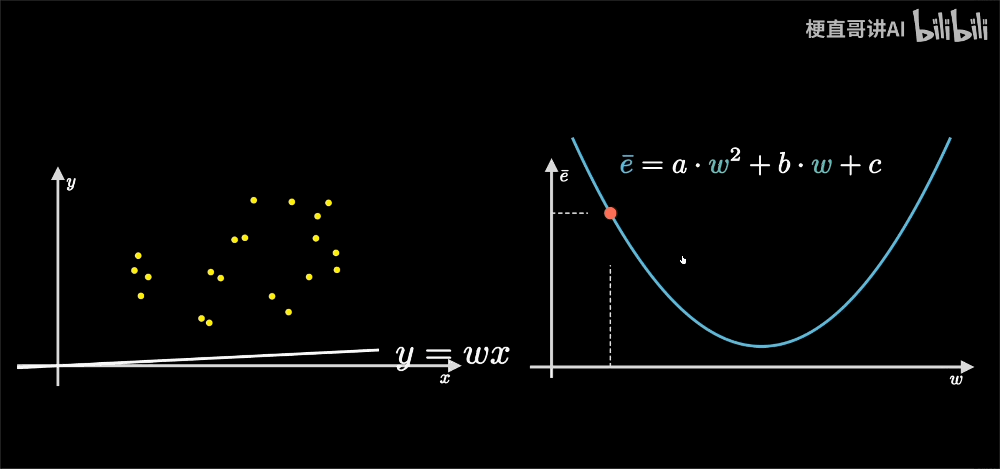

关于AI大家平时都听到过 训练、参数、模型等相关概念，但大家未必理解其真正含义，今天通过机器学习界的一个hello word案例让大家了解AI运行的本质过程。


# 房价预测模型

假设房价是y，影响房价的因素有3个x1,x2,x3，因此假设计算的公式是y1=w1*x1 + w2*x2 + w3*   x3，简化下就是y = w*x

假设我们需要训练出一个模型，已知影响房价因素的时候可以预测出房价，因此我们就需要解出w是什么，此处就有两个概念

w：训练要得到的参数

x：训练的样本数据


假设提供一批样本数据：

y1   x11  x21  x31

y2   x21  x22  x32


接下来我们随机假定一组参数 w1 w2 w3

y11=w1*x11 + w2* x12 + w3* x13

y22=w1*x21 + w2* x22 + w3* x23


然后计算y1-y11、y2-y22差值，差值越小，就代表解出的w参数越符合我们的预期。那如何让程序基于给定的训练数据自动化推断出最优的w呢？

看一组图片：




假设y=wx函数，已知一批x和y，需要求得最优的w。均方误差函数：
$\bar{e} = (\hat{Y} - Y)^2$，将wx代入函数，得到函数
$\bar{e} = (wx)^2 - 2wxy  + y^2$,因需求得w，我们已知了一批x和y的样本数据，那么认为w是变量，其它的为常量，简化的函数表达式就是：
$\bar{e} = a*w^2 +b*y  + c$，对应的是一个曲线函数。如图右图所示曲线中，当w的斜率最小时，损失函数的值最小,此时的值就是最优值。


那如何去用代码实现？涉及几个过程：

**前向计算**

给定一批数据，计算出结果，从输入层开始到输出层得到预测结果的过程称为前向计算。如计算y=w*x的结果，x是固定值，w是变化的

**反向传播**

当前层计算需要依赖上一层计算的梯度值进行计算 第一轮计算出来的值w，对应一个loss，同时会计算出值w对应的梯度W，此时loss还比较大，梯度W也较大，我们沿着梯度反方向基于学习率减少w的值，然后重新进行前向计算，又会得到w，loss，W的对应关系，如此反复，直到loss比较小。也就是第二轮的计算值依赖第一轮的值，重新进行前向计算。

**损失计算**

以前向计算结果和真实房价作为输入，通过损失函数square_error_cost API计算出损失函数值（Loss）

**梯度下降**


```
import numpy as np

class Network(object):
    def __init__(self, num_of_weights):
        # 随机产生w的初始值
        # 为了保持程序每次运行结果的一致性，此处设置固定的随机数种子
        #np.random.seed(0)
        self.w = np.random.randn(num_of_weights, 1)
        self.b = 0.
        
    def forward(self, x):
        z = np.dot(x, self.w) + self.b
        return z
    
    def loss(self, z, y):
        error = z - y
        num_samples = error.shape[0]
        cost = error * error
        cost = np.sum(cost) / num_samples
        return cost
    
    def gradient(self, x, y):
        z = self.forward(x)
        N = x.shape[0]
        gradient_w = 1. / N * np.sum((z-y) * x, axis=0)
        gradient_w = gradient_w[:, np.newaxis]
        gradient_b = 1. / N * np.sum(z-y)
        return gradient_w, gradient_b
    
    def update(self, gradient_w, gradient_b, eta = 0.01):
        self.w = self.w - eta * gradient_w
        self.b = self.b - eta * gradient_b
            
                
    def train(self, training_data, num_epochs, batch_size=10, eta=0.01):
        n = len(training_data)
        losses = []
        for epoch_id in range(num_epochs):
            # 在每轮迭代开始之前，将训练数据的顺序随机打乱
            # 然后再按每次取batch_size条数据的方式取出
            np.random.shuffle(training_data)
            # 将训练数据进行拆分，每个mini_batch包含batch_size条的数据
            mini_batches = [training_data[k:k+batch_size] for k in range(0, n, batch_size)]
            for iter_id, mini_batch in enumerate(mini_batches):
                #print(self.w.shape)
                #print(self.b)
                x = mini_batch[:, :-1]
                y = mini_batch[:, -1:]
                a = self.forward(x)
                loss = self.loss(a, y)
                gradient_w, gradient_b = self.gradient(x, y)
                self.update(gradient_w, gradient_b, eta)
                losses.append(loss)
                print('Epoch {:3d} / iter {:3d}, loss = {:.4f}'.
                                 format(epoch_id, iter_id, loss))
        
        return losses

# 获取数据
train_data, test_data = load_data()

# 创建网络
net = Network(13)
# 启动训练
losses = net.train(train_data, num_epochs=50, batch_size=100, eta=0.1)

# 画出损失函数的变化趋势
plot_x = np.arange(len(losses))
plot_y = np.array(losses)
plt.plot(plot_x, plot_y)
plt.show()
```

----


pytorch实现：

```
```


1：代码

2：房价预测模型

3：图像分类

4：标注

5：yolo模型训练


概念：参数，训练、神经网络