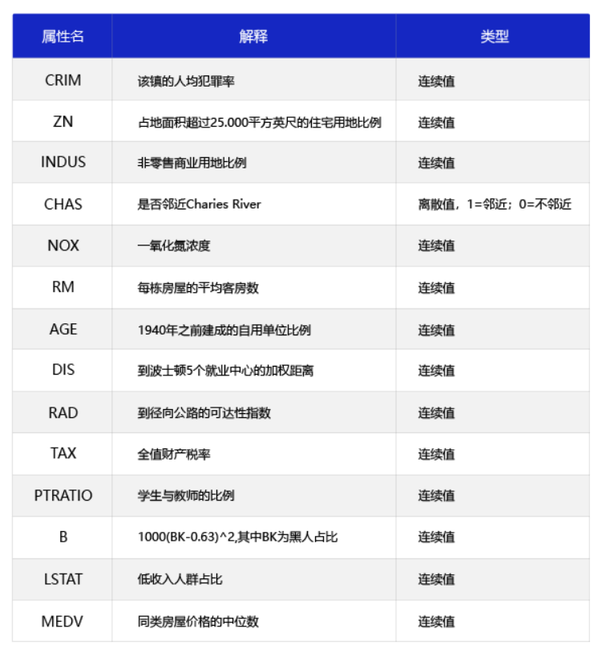
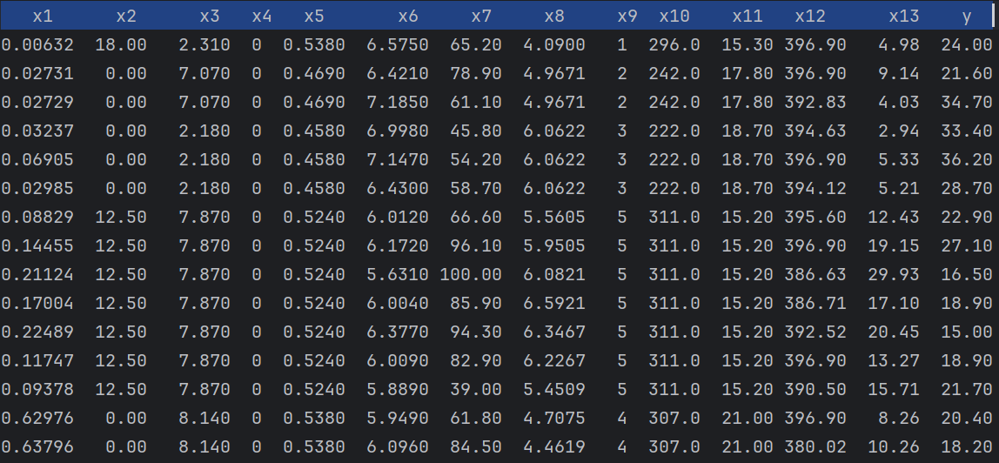
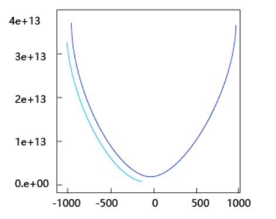
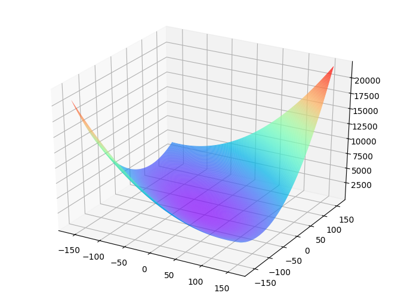
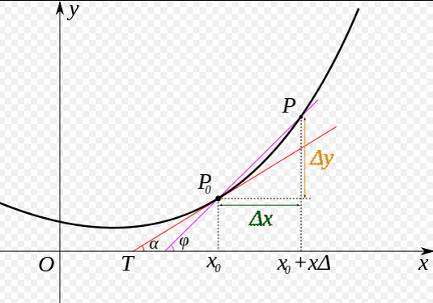
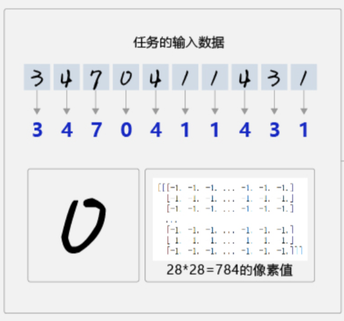
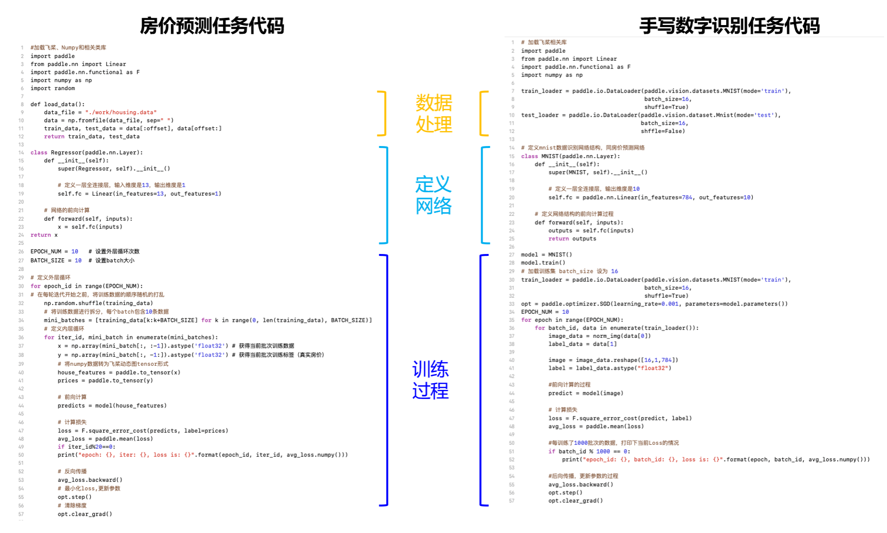

关于AI大家平时都听到过 训练、参数、模型等相关概念，但大家未必理解其真正含义，今天通过机器学习界的一个hello word案例让大家了解AI运行的本质过程。

1：理解什么是训练、参数、模型
2：模型训练的实际应用


# 一、房价预测模型

## 1.1 影响房价的因素



## 1.2 数据集




房价是y，影响房价的因素有13个$x1 \cdots x13 $，因此假设计算的公式是$y_1 = w_1 x_1 + w_2 x_2 + \cdots + w_{13} x_{13}$，简化下就是$y = w*x$

假设我们需要训练出一个模型，已知影响房价因素的时候可以预测出房价，因此我们就需要解出w是什么，此处就有两个概念

- w：训练要得到的参数

- x：训练的样本数据


假设提供一批样本数据：

```
y1   x1_1  x1_2  x1_3 ... x1_13

y2   x2_1  x2_2  x2_3 ... x2_13

...

yn   xn_1  xn_2  xn_3 ... xn_13
```

接下来我们随机假定一组参数 w1 w2 w3 ... w13

```
y11=w1*x1_1 + w2*x1_2 + w3*x1_3 + ... + w13*x1_13

y22=w1*x2_1 + w2*x2_2 + w3*x2_3 + ... + w13*x2_13

...

ynn=w1*n_1 + w2*xn_2 + w3*xn_3 + ... + w13*xn_13

```

然后计算y1-y1、y2-y22 ... yn - ynn差值，差值越小，就代表解出的w参数越符合我们的预期。那如何让程序基于给定的训练数据自动化推断出最优的w呢？

看一组图片：


将上面过程简化为$y=w*x$函数，已知一批x和y，需要求得最优的w。均方误差函数：
$\bar{e} = (\hat{Y} - Y)^2$，将wx代入函数，得到函数
$\bar{e} = (wx)^2 - 2wxy  + y^2$,因需求得w，我们已知了一批x和y的样本数据，那么认为w是变量，其它的为常量，简化的函数表达式就是：
$\bar{e} = a*w^2 +b*y  + c$，对应的是一个曲线函数。如图右图所示曲线中，当w的斜率最小时，损失函数的值最小,此时的值就是最优值。


## 1.3 训练过程

所有模型都是通过相同的过程进行模型训练

### **前向传播**

给定一批数据，计算出结果，从输入层开始到输出层得到预测结果的过程称为前向计算。如计算$y=w*x$的结果，x是固定值，w是变化的

###  **损失计算**

以前向计算结果和真实房价作为输入，通过损失函数square_error_cost API计算出损失函数值（Loss）


###  **反向传播**

当前层计算需要依赖上一层计算的梯度值进行计算 第一轮计算出来的值w，对应一个loss，同时会计算出值w对应的梯度W，此时loss还比较大，梯度W也较大，我们沿着梯度反方向基于学习率减少w的值，然后重新进行前向计算，又会得到w，loss，W的对应关系，如此反复，直到loss比较小。也就是第二轮的计算值依赖第一轮的值，重新进行前向计算。


### **梯度下降**

沿着损失函数下降最快的方向（梯度的反方向）一步步更新参数，最终走到损失函数的最低点。

```
import numpy as np

class Network(object):
    def __init__(self, num_of_weights):
        # 随机产生w的初始值
        # 为了保持程序每次运行结果的一致性，此处设置固定的随机数种子
        #np.random.seed(0)
        self.w = np.random.randn(num_of_weights, 1)
        self.b = 0.
        
    def forward(self, x):
        z = np.dot(x, self.w) + self.b
        return z
    
    def loss(self, z, y):
        error = z - y
        num_samples = error.shape[0]
        cost = error * error
        cost = np.sum(cost) / num_samples
        return cost
    
    def gradient(self, x, y):
        z = self.forward(x)
        N = x.shape[0]
        gradient_w = 1. / N * np.sum((z-y) * x, axis=0)
        gradient_w = gradient_w[:, np.newaxis]
        gradient_b = 1. / N * np.sum(z-y)
        return gradient_w, gradient_b
    
    def update(self, gradient_w, gradient_b, eta = 0.01):
        self.w = self.w - eta * gradient_w
        self.b = self.b - eta * gradient_b
            
                
    def train(self, training_data, num_epochs, batch_size=10, eta=0.01):
        n = len(training_data)
        losses = []
        for epoch_id in range(num_epochs):
            # 在每轮迭代开始之前，将训练数据的顺序随机打乱
            # 然后再按每次取batch_size条数据的方式取出
            np.random.shuffle(training_data)
            # 将训练数据进行拆分，每个mini_batch包含batch_size条的数据
            mini_batches = [training_data[k:k+batch_size] for k in range(0, n, batch_size)]
            for iter_id, mini_batch in enumerate(mini_batches):
                #print(self.w.shape)
                #print(self.b)
                x = mini_batch[:, :-1]
                y = mini_batch[:, -1:]
                a = self.forward(x)
                loss = self.loss(a, y)
                gradient_w, gradient_b = self.gradient(x, y)
                self.update(gradient_w, gradient_b, eta)
                losses.append(loss)
                print('Epoch {:3d} / iter {:3d}, loss = {:.4f}'.
                                 format(epoch_id, iter_id, loss))
        
        return losses

# 获取数据
train_data, test_data = load_data()

# 创建网络
net = Network(13)
# 启动训练
losses = net.train(train_data, num_epochs=50, batch_size=100, eta=0.1)

# 画出损失函数的变化趋势
plot_x = np.arange(len(losses))
plot_y = np.array(losses)
plt.plot(plot_x, plot_y)
plt.show()
```


## 1.4 梯度更新

**更新公式：**$W_新 = W_旧 - 学习率 × 梯度$
```
假设第一次：w = 1，斜率-10

更新一次：w = 1 - 0.01*（-10） = 1.1，此时斜率-9

再更新一次：w = 1.1 - 0.01*（-9） = 1.19，此时斜率-8 
```

## 1.5 梯度计算

**一维函数：梯度 = 斜率**

如果只有一个参数 w，损失函数是 L(w)，那么：

```
梯度 = ∂L/∂w = 斜率
```




**多维函数：梯度 = 每个方向的斜率组成的向量**

当有多个参数（w₁, w₂, ..., wₙ）时，梯度不再是一个数，而是一个向量：

```
梯度 = [∂L/∂w₁, ∂L/∂w₂, ..., ∂L/∂wₙ]
```




## 1.6 如何计算斜率

### 1.6.1 直线斜率

对于直线而言，斜率是固定的几何量，计算公式为
$m=\frac{y_2-y_1}{x_2-x_1}$ 表示纵坐标变化量与横坐标变化量的比值‌此时斜率与导数无关，仅描述直线的倾斜程度。

### 1.6.2 曲线切线斜率

对于函数图像上的曲线，某点处的导数值等于该点切线的斜率。导数的定义是函数在某点的瞬时变化率，其几何意义即为切线斜率‌
例如，若函数
$f(x)$ 在
$X_0$处可导则 
$f'\left(x_0\right)$即为该点切线斜率‌

斜率可以用来描述函数曲线在不同点上的变化速率。在微积分中，斜率被称为导数，可以通过导数来计算函数在某一点的变化率，并用于解决最优化、极值、速度、加速度等问题。

- 直线斜率是静态几何量，与导数无关；
- 曲线某点的导数值动态反映该点切线斜率，二者在几何意义上是等价的‌

基于微积分知识，求一条曲线在某个点的斜率等于函数在该点的导数值。我们知道两点确定一条直接，两点可以计算出直线的斜率




### 1.6.3 x²求导

导数的定义是： 
$f'(x) = \lim_{h \to 0} \frac{f(x+h) - f(x)}{h}$ 

对于
$f(x) = x^2$，代入： 
$f'(x) = \lim_{h \to 0} \frac{(x+h)^2 - x^2}{h}$


**1.展开
$(x+h)^2$:**

*  $(x+h)^2 = x^2 + 2xh + h^2$


**2.代入分子：**

*  $f'(x) = \lim_{h \to 0} \frac{x^2 + 2xh + h^2 - x^2}{h}$


**3.简化分子取消
$x^2$：**

*  $f'(x) = \lim_{h \to 0} \frac{2xh + h^2}{h}$


4.因式分解h： 
*  $f'(x) = \lim_{h \to 0} \frac{h(2x + h)}{h}$


**5.取消h（因为
$h \neq 0$）：**

*  $f'(x) = \lim_{h \to 0} (2x + h)$


**6.取极限（当 
$h \to 0$）：**

$f'(x) = 2x$

## 1.7 基于Pytorch的房价预测模型实现：
```
# ============================================================
# 1. 定义模型（对应你的 Network 类）
# ============================================================
class Network(nn.Module):
    def __init__(self, num_of_weights):
        super().__init__()
        # 对应 self.w = np.random.randn(num_of_weights, 1)
        # 对应 self.b = 0.
        self.linear = nn.Linear(num_of_weights, 1)

    def forward(self, x):
        # 对应 z = np.dot(x, self.w) + self.b
        return self.linear(x)


# ============================================================
# 2. 准备数据，代码省略
# ============================================================


# ============================================================
# 3. 创建网络、损失函数、优化器
# ============================================================
net = Network(13)
criterion = nn.MSELoss()                              # 对应你的 loss()
optimizer = optim.SGD(net.parameters(), lr=0.1)       # 对应你的 update()


# ============================================================
# 4. 训练循环（对应你的 train() 方法）
# ============================================================
def train(model, dataloader, criterion, optimizer, num_epochs):
    losses = []
    for epoch_id in range(num_epochs):
        for iter_id, (x, y) in enumerate(dataloader):
            # ---- 前向传播 ----
            a = model(x)                     # 对应 a = self.forward(x)

            # ---- 计算损失 ----
            loss = criterion(a, y)           # 对应 loss = self.loss(a, y)

            # ---- 反向传播 + 更新 ----
            optimizer.zero_grad()            # 清空梯度（NumPy版没有，因为每次直接算）
            loss.backward()                  # 对应 gradient_w, gradient_b = self.gradient(x, y)
            optimizer.step()                 # 对应 self.update(gradient_w, gradient_b, eta)

            losses.append(loss.item())
            print('Epoch {:3d} / iter {:3d}, loss = {:.4f}'.
                  format(epoch_id, iter_id, loss.item()))
    return losses


losses = train(net, train_loader, criterion, optimizer, num_epochs=50)


# 保存
torch.save(net, 'model_params.pth')


# ============================================================
# 预测流程
# ============================================================

# 1. 加载模型
net = Network(13)
net.load_state_dict(torch.load('model_params.pth'))
net.eval()  # 切换到预测模式（关闭Dropout/BatchNorm等训练专属层）

# 2. 准备新数据（假设有3个新样本，每个13个特征）
X_new = torch.tensor([
    [0.1, 0.2, 0.3, 0.4, 0.5, 0.6, 0.7, 0.8, 0.9, 1.0, 1.1, 1.2, 1.3],
    [0.2, 0.3, 0.4, 0.5, 0.6, 0.7, 0.8, 0.9, 1.0, 1.1, 1.2, 1.3, 1.4],
    [0.3, 0.4, 0.5, 0.6, 0.7, 0.8, 0.9, 1.0, 1.1, 1.2, 1.3, 1.4, 1.5],
], dtype=torch.float32)

# 3. 预测（关键：用 torch.no_grad() 关闭梯度计算）
with torch.no_grad():
    y_pred = net(X_new)

print("预测结果：")
print(y_pred)
print("形状：", y_pred.shape)  # (3, 1)
```


# 二、手写数字识别



全连接方式，每个像素分配一个参数进行计算
```
0-》w1*x1_1 + w2*x1_2 + w3*x1_3 + ... + w784*x1_784

1-》w1*x2_1 + w2*x2_2 + w3*x2_3 + ... + w784*x2_784

...

10-》w1*n_1 + w2*xn_2 + w3*xn_3 + ... + w784*xn_784

```




## 2.1 全连接方式进行手写数字识别存在的问题

- 问题1：如果图片稍微大一点（比如 256×256 = 65,536 个像素），参数直接爆炸

- 问题2：丢失空间结构
全连接的第一步是把 28×28 的图片拉直成 784 个数字,拉直之后，原本相邻的像素（比如第2行第3列的“1”和第3行第2列的“1”）在向量里可能隔了很远。
```
28×28 的二维图片：
┌─────────────────┐
│ 0  0  0  0  0   │
│ 0  0  1  1  0   │
│ 0  1  0  0  1   │
│ 0  1  0  0  1   │
│ 0  0  1  1  0   │
└─────────────────┘
        ↓ 拉直
[0,0,0,0,0, 0,0,1,1,0, 0,1,0,0,1, 0,1,0,0,1, 0,0,1,1,0]
```
- 问题3：泛化能力极差：训练集里的“5”都在中间，测试时“5”偏左，模型就不认识了

- 问题4：无法提取局部特征,全连接网络是“全局”的：每个输出神经元都接收所有784个像素的输入。它没有“感受野”的概念，无法像卷积核那样：先看局部（3×3的小块）再组合成更大的特征（横线、竖线、圆圈）

## 2.2 手写数字图片识别训练过程

```
┌─────────────────────────────────────────────────────────────────────────────────────┐
│                   手写数字识别训练流程（CNN卷积神经网络）                            │
│              输入 28×28 图片 → 输出 10 个类别                                      │
│              网络结构：Conv1(6个3×3核) → 池化 → Conv2(16个3×3核) → 池化 → 全连接   │
└─────────────────────────────────────────────────────────────────────────────────────┘
                                        │
                                        ▼
┌─────────────────────────────────────────────────────────────────────────────────────┐
│ 1. 初始化所有参数（随机）                                                           │
│                                                                                     │
│    【卷积层1】Conv1：6个 3×3 卷积核 + 6个偏置                                      │
│    每个卷积核形状：3×3（9个权重）                                                   │
│    参数总量：6 × 9 + 6 = 60 个                                                     │
│                                                                                     │
│    【卷积层2】Conv2：16个 3×3×6 卷积核 + 16个偏置                                  │
│    每个卷积核形状：3×3×6（54个权重，深度匹配Conv1输出的6张特征图）                  │
│    参数总量：16 × 54 + 16 = 880 个                                                  │
│                                                                                     │
│    【全连接层1】FC1：展平后 16×5×5=400 个特征 → 120 个神经元                       │
│    权重 W3：400×120 = 48,000 个 + 偏置 b3（120个）                                 │
│    参数总量：48,120 个                                                               │
│                                                                                     │
│    【全连接层2】FC2（输出层）：120 → 10 个类别                                      │
│    权重 W4：120×10 = 1,200 个 + 偏置 b4（10个）                                    │
│    参数总量：1,210 个                                                               │
│                                                                                     │
│    【总参数】60 + 880 + 48,120 + 1,210 = 50,270 个                                  │
│    （相比全连接网络的101,642个，减少了约50%，且准确率更高）                          │
└─────────────────────────────────────────────────────────────────────────────────────┘
                                        │
                                        ▼
┌─────────────────────────────────────────────────────────────────────────────────────┐
│ 2. 前向传播（卷积 + 池化 + 全连接）                                                 │
│                                                                                     │
│    输入一张 28×28 灰度图，像素值 0~1：X（1×28×28）                                  │
│    举例：X = [0.1, 0.3, 0.8, ..., 0.9]（784个数字，保留二维结构）                  │
│                                                                                     │
│    【卷积层1】Conv1：6个 3×3 卷积核在 28×28 图上滑动                                 │
│    ┌─────────────────────────────────────────────────────────────────┐               │
│    │  卷积核1（随机）  [0.1, -0.2, 0.3]    扫描整张图 → 特征图1    │               │
│    │                   [0.4, 0.1, -0.3]    (28-3+1=26×26)        │               │
│    │                   [-0.2, 0.3, 0.1]                           │               │
│    │  卷积核2（随机）  [...]              扫描整张图 → 特征图2    │               │
│    │  ...（共6个核）                        → 特征图3~6          │               │
│    └─────────────────────────────────────────────────────────────────┘               │
│    输出：6张 26×26 的特征图（每个卷积核生成1张）                                     │
│    计算量：6 × 26×26 × 9 = 36,504 次乘法                                            │
│                                                                                     │
│    【池化层1】MaxPooling：2×2 窗口，步长2，取最大值                                  │
│    每张 26×26 特征图 → 13×13（尺寸减半）                                            │
│    输出：6张 13×13 的特征图（参数不变，只压缩尺寸）                                  │
│                                                                                     │
│    【卷积层2】Conv2：16个 3×3×6 卷积核（深度匹配输入的6张图）                       │
│    ┌─────────────────────────────────────────────────────────────────┐               │
│    │  每个卷积核是立体的：3×3×6（54个权重）                        │               │
│    │  在 6张 13×13 的图上滑动（每次看一个3×3×6的小方块）          │               │
│    │  16个核 → 16张 11×11 的特征图                               │               │
│    └─────────────────────────────────────────────────────────────────┘               │
│    输出：16张 11×11 的特征图（每个卷积核生成1张）                                    │
│    计算量：16 × 11×11 × 54 = 104,544 次乘法                                         │
│                                                                                     │
│    【池化层2】MaxPooling：2×2 窗口，步长2                                            │
│    每张 11×11 → 5×5（向下取整）                                                     │
│    输出：16张 5×5 的特征图                                                           │
│                                                                                     │
│    【展平（Flatten）】                                                               │
│    把 16张 5×5 的特征图拉直成一维向量：16×5×5 = 400 个数字                          │
│    输出：F（1×400）                                                                  │
│                                                                                     │
│    【全连接层1】FC1：F（1×400）· W3（400×120）+ b3（120）                           │
│    输出：H（1×120）  ← 120个高级特征                                                │
│                                                                                     │
│    【全连接层2】FC2：H（1×120）· W4（120×10）+ b4（10）                             │
│    输出：logits（1×10）  ← 10个原始分数                                             │
│                                                                                     │
│    【Softmax】转概率                                                                 │
│    probs = softmax(logits) → 10个概率，总和=1                                       │
│    举例：probs = [0.01, 0.03, 0.02, 0.01, 0.80, 0.05, 0.02, 0.01, 0.03, 0.02]    │
│                      ↑                                                               │
│                   预测为"4"的概率80%                                                 │
└─────────────────────────────────────────────────────────────────────────────────────┘
                                        │
                                        ▼
┌─────────────────────────────────────────────────────────────────────────────────────┐
│ 3. 计算损失（交叉熵）                                                               │
│                                                                                     │
│    真实标签：这张图是"4"                                                             │
│    独热编码 Y_true = [0, 0, 0, 0, 1, 0, 0, 0, 0, 0]（第4个位置是1）               │
│                                                                                     │
│    交叉熵损失：L = -Σ Y_true_j × log(probs_j)                                      │
│                  = -log(probs_4)                                                    │
│                  = -log(0.80) = 0.2231                                              │
│                                                                                     │
│    损失 L = 0.2231（比全连接网络的2.52小很多，说明CNN初始预测就更准）               │
└─────────────────────────────────────────────────────────────────────────────────────┘
                                        │
                                        ▼
┌─────────────────────────────────────────────────────────────────────────────────────┐
│ 4. 反向传播（核心：梯度逐层回传，卷积核共享梯度）                                    │
│                                                                                     │
│    【输出层梯度】                                                                   │
│    ∂L/∂logits = probs - Y_true（10个梯度）                                         │
│    举例：∂L/∂logits = [0.01, 0.03, 0.02, 0.01, 0.80-1, 0.05, 0.02, 0.01, 0.03,    │
│                        0.02]                                                       │
│                      = [0.01, 0.03, 0.02, 0.01, -0.20, 0.05, 0.02, 0.01, 0.03,    │
│                         0.02]                                                      │
│    含义：第4个位置（数字4）的梯度为负，需要调高该位置的分数                          │
│                                                                                     │
│    【全连接层2梯度】                                                                 │
│    ∂L/∂W4 = Hᵀ · ∂L/∂logits = (120×1)·(1×10) = (120×10)                          │
│    ∂L/∂b4 = ∂L/∂logits（10个）                                                      │
│                                                                                     │
│    【全连接层1梯度】                                                                 │
│    ∂L/∂H = ∂L/∂logits · W4ᵀ = (1×10)·(10×120) = (1×120)                          │
│    ∂L/∂W3 = Fᵀ · ∂L/∂H = (400×1)·(1×120) = (400×120)                             │
│    ∂L/∂b3 = ∂L/∂H（120个）                                                          │
│                                                                                     │
│    【池化层】                                                                       │
│    池化层没有参数，但需要把梯度传回去：                                               │
│    在MaxPooling中，梯度只传给"被选中（最大值）"的那个位置，其他位置梯度=0            │
│    这保证了误差能追溯到最关键的像素位置                                              │
│                                                                                     │
│    【卷积层2梯度】（关键！权重共享的体现）                                            │
│    ┌─────────────────────────────────────────────────────────────────────────┐       │
│    │  损失 L 对 Conv2 的 16个 3×3×6 卷积核分别算梯度                        │       │
│    │                                                                         │       │
│    │  对于某个卷积核 K（3×3×6）：                                             │       │
│    │  ∂L/∂K = 输入特征图 · 回传的梯度（反卷积操作）                         │       │
│    │          = (6×13×13) 与 (16×11×11) 的互相关                           │       │
│    │          = (3×3×6)  ← 和卷积核形状一致！                              │       │
│    │                                                                         │       │
│    │  【重点】这个梯度包含了所有滑动位置的贡献（求和）                        │       │
│    │  同一个卷积核在不同位置产生的梯度，全部累加起来，然后统一更新这个核       │       │
│    │  这就是"权重共享"在反向传播中的体现！                                   │       │
│    └─────────────────────────────────────────────────────────────────────────┘       │
│    ∂L/∂b2 = 每个输出特征图上所有梯度的和（16个）                                    │
│                                                                                     │
│    【卷积层1梯度】（同理）                                                           │
│    ∂L/∂Conv1 = 回传的梯度 · 池化层1的逆操作 · 输入X = (6×3×3)                      │
│    ∂L/∂b1 = 6个                                                                     │
│                                                                                     │
│    【梯度总结】                                                                     │
│    ┌───────────────┬─────────────┬──────────────────────────────────┐               │
│    │ 参数          │ 形状        │ 梯度数量                         │               │
│    ├───────────────┼─────────────┼──────────────────────────────────┤               │
│    │ ∂L/∂W4 (FC2)  │ 120×10      │ 1,200                            │               │
│    │ ∂L/∂b4 (FC2)  │ 10          │ 10                               │               │
│    │ ∂L/∂W3 (FC1)  │ 400×120     │ 48,000                           │               │
│    │ ∂L/∂b3 (FC1)  │ 120         │ 120                              │               │
│    │ ∂L/∂Conv2     │ 16×3×3×6    │ 864（16×54）                     │               │
│    │ ∂L/∂b2 (Conv2)│ 16          │ 16                               │               │
│    │ ∂L/∂Conv1     │ 6×3×3       │ 54（6×9）                        │               │
│    │ ∂L/∂b1 (Conv1)│ 6           │ 6                                │               │
│    └───────────────┴─────────────┴──────────────────────────────────┘               │
│    总共 50,270 个梯度值（每个参数一个梯度）                                          │
└─────────────────────────────────────────────────────────────────────────────────────┘
                                        │
                                        ▼
┌─────────────────────────────────────────────────────────────────────────────────────┐
│ 5. 更新参数（每个参数独立更新）                                                      │
│                                                                                     │
│    学习率 lr = 0.001                                                               │
│                                                                                     │
│    【全连接层更新（和普通神经网络一样）】                                             │
│    W4_新 = W4_旧 - lr × ∂L/∂W4                                                     │
│    W3_新 = W3_旧 - lr × ∂L/∂W3                                                     │
│    b4_新 = b4_旧 - lr × ∂L/∂b4                                                     │
│    b3_新 = b3_旧 - lr × ∂L/∂b3                                                     │
│                                                                                     │
│    【卷积层更新（核心区别）】                                                        │
│    Conv2_新 = Conv2_旧 - lr × ∂L/∂Conv2  ← 每个卷积核整体更新                      │
│    b2_新 = b2_旧 - lr × ∂L/∂b2                                                     │
│                                                                                     │
│    Conv1_新 = Conv1_旧 - lr × ∂L/∂Conv1  ← 每个卷积核整体更新                      │
│    b1_新 = b1_旧 - lr × ∂L/∂b1                                                     │
│                                                                                     │
│    举例（Conv1中的一个卷积核更新）：                                                │
│    旧卷积核： [0.1, -0.2, 0.3]                                                     │
│               [0.4, 0.1, -0.3]                                                     │
│               [-0.2, 0.3, 0.1]                                                     │
│    梯度：     [-0.5, 0.3, -0.1]                                                    │
│               [0.2, -0.4, 0.3]                                                     │
│               [0.1, -0.2, 0.5]                                                     │
│    新卷积核： [0.1005, -0.2003, 0.3001]  ← 每个元素独立更新                        │
│               [0.3998, 0.1004, -0.3003]                                            │
│               [-0.2001, 0.3002, 0.0995]                                            │
│                                                                                     │
│    注意：整个卷积核 9 个元素全部更新，但更新量来自所有滑动位置的梯度之和              │
│                                                                                     │
│    【所有 50,270 个参数同步更新一次】                                                │
└─────────────────────────────────────────────────────────────────────────────────────┘
                                        │
                                        ▼
                        ┌─────────────────────────────────┐
                        │ 判断是否收敛？                   │
                        │ （损失变化 < 阈值 或             │
                        │  达到最大迭代次数）              │
                        └─────────────────────────────────┘
                           │              │
                         是              否
                           │              │
                           ▼              ▼
                    ┌────────────┐  ┌──────────────────────────┐
                    │ 训练完成   │  │ 回到第2步                │
                    │ 输出所有   │  │ 开始下一轮迭代           │
                    │ 卷积核和   │  │ （共数万轮）             │
                    │ 全连接参数 │  └──────────────────────────┘
                    └────────────┘
```


# 三、自然语言


```
┌─────────────────────────────────────────────────────────────────────────────────────┐
│                   自然语言模型训练流程（Transformer）                               │
│              输入：单词序列 → 输出：下一个词的概率分布                              │
│              结构：嵌入层 → 注意力层 → 前馈层 → 输出层                              │
└─────────────────────────────────────────────────────────────────────────────────────┘
                                        │
                                        ▼
┌─────────────────────────────────────────────────────────────────────────────────────┐
│ 1. 数据准备：把文本变成数字                                                         │
│                                                                                     │
│    原始文本："我 爱 机器 学习"                                                      │
│         ↓ 分词                                                                      │
│    ["我", "爱", "机器", "学习"]                                                     │
│         ↓ 查词表（Vocab）                                                           │
│    [0, 1, 2, 3]        ← 每个词变成一个整数ID                                       │
│         ↓ 构建训练样本                                                              │
│    输入：["我", "爱", "机器"] → 输出（标准答案）："学习"                            │
│                                                                                     │
│    词表示例：                                                                       │
│    ┌────────┬──────┐                                                                │
│    │ 词     │ ID   │                                                                │
│    ├────────┼──────┤                                                                │
│    │ 我     │ 0    │                                                                │
│    │ 爱     │ 1    │                                                                │
│    │ 机器   │ 2    │                                                                │
│    │ 学习   │ 3    │                                                                │
│    │ <PAD>  │ 4    │                                                                │
│    └────────┴──────┘                                                                │
└─────────────────────────────────────────────────────────────────────────────────────┘
                                        │
                                        ▼
┌─────────────────────────────────────────────────────────────────────────────────────┐
│ 2. 初始化参数（随机）                                                               │
│                                                                                     │
│    【参数①】词嵌入矩阵：词表大小 × 嵌入维度（如 5 × 3）                             │
│    每行对应一个词的向量：                                                           │
│    ┌─────────────────────────────┐                                                  │
│    │ 我   → [0.1, 0.2, 0.3]     │                                                  │
│    │ 爱   → [0.4, 0.5, 0.6]     │                                                  │
│    │ 机器 → [0.7, 0.8, 0.9]     │                                                  │
│    │ 学习 → [0.2, 0.3, 0.4]     │                                                  │
│    │ PAD  → [0.0, 0.0, 0.0]     │                                                  │
│    └─────────────────────────────┘                                                  │
│                                                                                     │
│    【参数②】注意力投影矩阵：W_Q、W_K、W_V（3 × 3）                                  │
│    【参数③】前馈网络权重：W1（3 × 4）、W2（4 × 3）                                  │
│    【参数④】输出层权重：W_out（3 × 5）                                              │
│                                                                                     │
│    总参数：嵌入矩阵15 + 注意力27 + 前馈24 + 输出15 ≈ 81个（真实模型1.1亿+）          │
└─────────────────────────────────────────────────────────────────────────────────────┘
                                        │
                                        ▼
┌─────────────────────────────────────────────────────────────────────────────────────┐
│ 3. 前向传播（Transformer）                                                          │
│                                                                                     │
│    【第1步】词嵌入：输入ID → 查表 → 向量                                            │
│    输入 ["我", "爱", "机器"] → [0, 1, 2]                                            │
│         ↓                                                                           │
│    X = [[0.1, 0.2, 0.3],   ← 我                                                    │
│         [0.4, 0.5, 0.6],   ← 爱                                                    │
│         [0.7, 0.8, 0.9]]   ← 机器                                                  │
│                                                                                     │
│    【第2步】自注意力：计算词与词的关系                                              │
│    ┌─────────────────────────────────────────────────────────────────┐              │
│    │ Q = X · W_Q   K = X · W_K   V = X · W_V                        │              │
│    │                                                                 │              │
│    │ 注意力分数 = Q · Kᵀ                                            │              │
│    │ 注意力权重 = Softmax(分数 / √d)                                │              │
│    │ 注意力输出 = 权重 · V                                          │              │
│    └─────────────────────────────────────────────────────────────────┘              │
│    输出：每个词融合了上下文信息的新向量                                             │
│    Z = [[0.448, 0.548, 0.648],   ← 我（融合了"爱""机器"的信息）                   │
│         [0.475, 0.575, 0.675],   ← 爱                                              │
│         [0.505, 0.605, 0.705]]   ← 机器（融合了"我""爱"的信息）                   │
│                                                                                     │
│    【第3步】前馈网络：非线性变换                                                    │
│    F = ReLU(Z · W1 + b1) · W2 + b2                                                  │
│    输出：F = [[...], [...], [...]]                                                  │
│                                                                                     │
│    【第4步】取最后一个位置的向量 → 输出层                                           │
│    最后位置（机器）的向量：[0.505, 0.605, 0.705]                                    │
│         ↓                                                                           │
│    logits = [0.505, 0.605, 0.705] · W_out(3×5) + b_out                              │
│           = [0.5, 0.3, 0.1, 0.4, 0.2]   ← 5个词的原始分数                          │
│         ↓ Softmax                                                                   │
│    probs = [0.24, 0.20, 0.16, 0.22, 0.18]                                           │
│             ↑     ↑     ↑     ↑     ↑                                               │
│             我    爱   机器  学习  PAD                                              │
│                                                                                     │
│    预测结果：概率最高是"我"（24%）→ 但正确答案是"学习"（22%）→ 预测错误！          │
└─────────────────────────────────────────────────────────────────────────────────────┘
                                        │
                                        ▼
┌─────────────────────────────────────────────────────────────────────────────────────┐
│ 4. 计算损失（交叉熵）                                                               │
│                                                                                     │
│    真实标签："学习" → 独热编码 [0, 0, 0, 1, 0]                                      │
│    预测概率：[0.24, 0.20, 0.16, 0.22, 0.18]                                         │
│                                                                                     │
│    交叉熵损失：L = -log(P(学习)) = -log(0.22) = 1.51                                │
│                                                                                     │
│    损失越大 → 预测越不准 → 需要更新的幅度越大                                       │
└─────────────────────────────────────────────────────────────────────────────────────┘
                                        │
                                        ▼
┌─────────────────────────────────────────────────────────────────────────────────────┐
│ 5. 反向传播（链式法则逐层回传）                                                     │
│                                                                                     │
│    【输出层梯度】                                                                   │
│    ∂L/∂logits = probs - 独热编码                                                    │
│              = [0.24, 0.20, 0.16, -0.78, 0.18]                                      │
│    含义："学习"位置梯度为负 → 需要调高该位置分数                                     │
│                                                                                     │
│    【逐层回传】                                                                     │
│    损失 L                                                                           │
│       ↓                                                                             │
│    ∂L/∂W_out（输出层权重）                                                          │
│       ↓                                                                             │
│    ∂L/∂前馈网络（W1、W2）                                                           │
│       ↓                                                                             │
│    ∂L/∂W_Q、∂L/∂W_K、∂L/∂W_V（注意力投影矩阵）                                     │
│       ↓                                                                             │
│    ∂L/∂词嵌入矩阵                                                                   │
│                                                                                     │
│    【梯度总结】                                                                     │
│    ┌───────────────────┬─────────────┬──────────────────────┐                      │
│    │ 参数              │ 形状        │ 梯度数量             │                      │
│    ├───────────────────┼─────────────┼──────────────────────┤                      │
│    │ ∂L/∂W_out         │ 3×5         │ 15                   │                      │
│    │ ∂L/∂W1、W2        │ 3×4、4×3    │ 24                   │                      │
│    │ ∂L/∂W_Q、K、V     │ 3×3 ×3      │ 27                   │                      │
│    │ ∂L/∂词嵌入矩阵    │ 5×3         │ 15                   │                      │
│    └───────────────────┴─────────────┴──────────────────────┘                      │
│    总共约81个梯度值（每个参数一个梯度）                                             │
└─────────────────────────────────────────────────────────────────────────────────────┘
                                        │
                                        ▼
┌─────────────────────────────────────────────────────────────────────────────────────┐
│ 6. 更新参数（梯度下降）                                                             │
│                                                                                     │
│    学习率 lr = 0.1                                                                  │
│                                                                                     │
│    词嵌入矩阵_新 = 词嵌入矩阵_旧 - lr × ∂L/∂词嵌入矩阵                              │
│    W_Q_新 = W_Q_旧 - lr × ∂L/∂W_Q                                                  │
│    W_K_新 = W_K_旧 - lr × ∂L/∂W_K                                                  │
│    W_V_新 = W_V_旧 - lr × ∂L/∂W_V                                                  │
│    W1_新 = W1_旧 - lr × ∂L/∂W1                                                     │
│    W2_新 = W2_旧 - lr × ∂L/∂W2                                                     │
│    W_out_新 = W_out_旧 - lr × ∂L/∂W_out                                            │
│                                                                                     │
│    举例（词嵌入矩阵中"学习"那行）：                                                 │
│    旧值：[0.2, 0.3, 0.4]                                                            │
│    梯度：[-0.1, 0.05, -0.08]                                                        │
│    新值：[0.21, 0.295, 0.408]                                                       │
│                                                                                     │
│    【所有约81个参数同步更新一次】                                                   │
└─────────────────────────────────────────────────────────────────────────────────────┘
                                        │
                                        ▼
                        ┌─────────────────────────────┐
                        │ 判断是否收敛？               │
                        │ （验证损失不再下降 或        │
                        │  达到最大迭代次数）          │
                        └─────────────────────────────┘
                           │              │
                         是              否
                           │              │
                           ▼              ▼
                    ┌────────────┐  ┌──────────────────────────┐
                    │ 训练完成   │  │ 回到第3步                │
                    │ 保存词嵌入 │  │ 开始下一轮迭代           │
                    │ 矩阵、W_Q/ │  │ （共数万~数十万轮）      │
                    │ K/V、W_out │  └──────────────────────────┘
                    └────────────┘
```

## 3.1 注意力机制

**`W_Q`、`W_K`、`W_V` 是三组全连接层的权重矩阵，它们把同一个词向量映射成三个不同的“角色”：Query（查询者）、Key（被查询者）、Value（信息提供者）。**

你可以把它们理解为**三副不同的“眼镜”**——戴上Query眼镜，这个词就在问“谁和我有关？”；戴上Key眼镜，这个词就等着被问“你和我有关吗？”；戴上Value眼镜，这个词就准备把实际信息交出去。

### 1. 它们到底在算什么？（一句话讲清）

这三个矩阵是**自注意力机制**的核心参数。自注意力的目的是，让句子里的每个词都能**看看其他词，并决定哪些词对自己更重要**。

-   **Query (Q)**：**我在找什么？**
-   **Key (K)**：**我是什么？**
-   **Value (V)**：**我身上有什么信息？**

它们的计算过程就是：用**当前词**的Q去和**所有词**的K做匹配，算出“注意力权重”，然后用这个权重去加权平均所有词的V，得到**融合了上下文信息的新词向量**。这个过程和CNN用卷积核在图像上滑动、提取局部特征有异曲同工之妙。

---

### 2. 用具体数值举例

还是用之前那个句子：“我 爱 机器 学习”。为了让你看清数值流向，我沿用简化的3维向量，和随机初始化的投影矩阵。

**输入是3个词的向量**，形状为 `(3, 3)`。

**第1步：投影生成 Q、K、V**
我们有三组形状为 `(3, 3)` 的权重矩阵 `W_Q`、`W_K`、`W_V`（为了演示，把它们设为对角矩阵，即单位矩阵，这样Q=K=V）：

-   把“我”的向量 `[0.1, 0.2, 0.3]` 分别乘上三个矩阵，得到：
    -   Q_我 = `[0.1, 0.2, 0.3]`
    -   K_我 = `[0.1, 0.2, 0.3]`
    -   V_我 = `[0.1, 0.2, 0.3]`
-   同样，对“爱”和“机器”也做同样的操作。

**第2步：计算注意力分数（Q 和 K 点积）**
用“我”的 Q 去和所有词的 K 做点积，得到一个分数，这个分数就代表“我”和每个词的相关度：

-   “我”和“我”的分数：`[0.1,0.2,0.3]` · `[0.1,0.2,0.3]` = **0.14**
-   “我”和“爱”的分数：`[0.1,0.2,0.3]` · `[0.4,0.5,0.6]` = **0.32**
-   “我”和“机器”的分数：`[0.1,0.2,0.3]` · `[0.7,0.8,0.9]` = **0.50**

分数越高，说明“我”和这个词的关系越紧密。

**第3步：转换成权重（Softmax）**
把这些分数转成权重，让它们加起来等于1：`[0.27, 0.30, 0.43]`。
这表示“我”在理解自己的时候，会把27%的注意力放在自己身上，30%放在“爱”身上，43%放在“机器”身上。

**第4步：加权求和得到新向量（Weighted Sum with V）**
最后，用这些权重去乘以所有词的 V，并求和，就得到了“我”这个位置**融合了上下文信息的新向量**：
`新向量_我 = 0.27*V_我 + 0.30*V_爱 + 0.43*V_机器 = [0.448, 0.548, 0.648]`

看，经过这个过程，“我”的新向量里已经包含了“爱”和“机器”的信息，它不再是孤立的一个词了！整个过程就像CNN里一个3x3的卷积核滑过图片，把这个局部区域的信息“融合”成一个新像素。

---

### 3. 和之前学过的知识对应

-   **它们和房价预测的 `W` 是什么关系？**
    **本质一样**。`W_Q`、`W_K`、`W_V` 就是三组普通的**全连接层权重**，和 `房价 = 面积*w1 + 卧室数*w2 + b` 里的 `[w1, w2]` 毫无区别。它们都是**可学习的参数**，训练的目标就是调整它们里面的数字。

-   **它们和CNN的卷积核是什么关系？**
    **角色类似**。卷积核是“特征提取器”，提取图像上的“横线、竖线”等空间特征；而 `W_Q`、`W_K`、`W_V` 是“关系提取器”，提取文本中词与词之间的“依赖关系”特征。它们都是随着训练而自动调整的。

---

### 4. 多组 `W_Q`、`W_K`、`W_V`（多头注意力）

你可能会想：“一组就够了，为什么要用多组呢？”
因为一组 `W_Q`、`W_K`、`W_V` 只能从**一个角度**去理解词与词的关系（比如只关注语法）。为了能同时关注语法、语义、指代等多种关系，Transformer会使用**多组**这样的矩阵。这就是**多头注意力**（Multi-Head Attention）：

-   第1个头可能学会了“主谓关系”：关注“我”和“爱”。
-   第2个头可能学会了“动宾关系”：关注“爱”和“机器”。
-   第3个头可能学会了“上下文关联”：关注“机器”和“学习”。

每一组都独立做我上面演示的那一套计算，最后再拼接起来。这样模型就能从多个角度理解整个句子。每个头就像CNN里的一个独立的卷积核，有的检测横线，有的检测竖线，各司其职。

### 总结

> **`W_Q`、`W_K`、`W_V` 是三组可学习的权重矩阵，它们把每个词向量投影成三个角色。整个自注意力机制就是：用Q和K计算词间关系，再用这个关系去加权抽取V中的信息。它们的训练方式和房价预测中的 `W` 完全一样，都是通过梯度下降来更新，让模型学会该关注句子中的哪些词。**


# 四、案例
## 4.1 YOLO模型训练案例

## 4.2 自然语言训练案例


