 

# 一、人工智能、机器学习、深度学习的关系

**人工智能（ArtificialIntelligence，AI）** 是研发用于模拟、延伸和扩展人的智能的理论、方法、技术及应用系统的一门新的技术科学。它只阐述了目标，而没有限定方法，因此实现人工智能存在的诸多方法和分支。

**机器学习（MachineLearning，ML）** 是当前比较有效的一种实现人工智能的方式。

**深度学习（DeepLearning，DL）** 是机器学习算法中最热门的一个分支，近些年取得了显著的进展，并替代了大多数传统机器学习算法。

## 1.1 机器学习

### 机器学习

是专门研究计算机怎样模拟或实现人类的学习行为，以获取新的知识或技能，重新组织已有的知识结构，使之不断改善自身的性能。

### 机器学习的实现

**归纳：** 从具体案例中抽象一般规律，机器学习中的“训练”亦是如此。从一定数量的样本（已知模型输入X和模型输出Y）中，学习输出Y与输入X的关系（可以想象成是某种表达式）。

**演绎：** 从一般规律推导出具体案例的结果，机器学习中的“预测”亦是如此。基于训练得到的Y与X之间的关系，如出现新的输入X，计算出输出Y。通常情况下，如果通过模型计算的输出和真实场景的输出一致，则说明模型是有效的。

### 机器学习方法论（假设、评价、优化）

假设机器通过尝试答对（最小化损失）大量的习题（已知样本）来学习知识（模型参数w），并期望用学习到的知识所代表的模型H(w,x)，回答不知道答案的考试题（未知样本）。最小化损失是模型的优化目标，实现损失最小化的方法称为优化算法，也称为寻解算法（找到使得损失函数最小的参数解）。参数w和输入x组成公式的基本结构称为假设。模型**假设**、**评价**函数（损失/优化目标）和**优化**算法是构成模型的三个关键要素。

机器执行学习任务的框架体现了其**学习的本质是“参数估计”**（Learning is parameter estimation）。

## 1.2 深度学习

相比传统的机器学习算法，其实两者在理论结构上是一致的，即：模型假设、评价函数和优化算法，其根本差别在于假设的复杂度。

深度学习成功所依赖的先决条件：大数据涌现、硬件发展和算法优化

### 神经网络的基本概念

**神经元：** 神经网络中每个节点称为神经元，由两部分组成：
  - 加权和： 将所有输入加权求和。
  - 非线性变换（激活函数）：加权和的结果经过一个非线性函数变换，让神经元计算具备非线性的能力。

**多层连接：** 大量这样的节点按照不同的层次排布，形成多层的结构连接起来，即称为神经网络。

**前向计算：** 从输入计算输出的过程，顺序从网络前至后。

**计算图：** 以图形化的方式展现神经网络的计算逻辑又称为计算图，也可以将神经网络的计算图以公式的方式表达：

### 深度学习改变了AI应用的研发模式

**实现了端到端的学习** 深度学习改变了很多领域算法的实现模式。在深度学习兴起之前，很多领域建模的思路是投入大量精力做特征工程，将专家对某个领域的“人工理解”沉淀成特征表达，然后使用简单模型完成任务（如分类或回归）。而在数据充足的情况下，深度学习模型可以实现端到端的学习，即不需要专门做特征工程，将原始的特征输入模型中，模型可同时完成特征提取和分类任务。以计算机视觉任务为例，特征工程是诸多图像科学家基于人类对视觉理论的理解，设计出来的一系列提取特征的计算步骤。

**实现了深度学习框架标准化** 深度学习还推动人工智能进入工业大生产阶段，算法的通用性导致标准化、自动化和模块化的框架产生。在此之前，不同流派的机器学习算法理论和实现均不同，导致每个算法均要独立实现，如随机森林和支撑向量机（SVM）。但在深度学习框架下，不同模型的算法结构有较大的通用性，如常用于计算机视觉的卷积神经网络模型（CNN）和常用于自然语言处理的长期短期记忆模型(LSTM)，都可以分为组网模块、梯度下降的优化模块和预测模块等。这使得抽象出统一的框架成为了可能，并大大降低了编写建模代码的成本。一些相对通用的模块，如网络基础算子的实现、各种优化算法等都可以由框架实现。建模者只需要关注数据处理，配置组网的方式，以及用少量代码串起训练和预测的流程即可。

# 二、使用Python和NumPy构建神经网络模型

对于预测问题，可以根据预测输出的类型是连续的实数值（回归任务），还是离散的标签（分类任务），区分为回归任务和分类任务。

## 线性回归模型

假设房价和各影响因素之间能够用线性关系来描述：
$y=\sum_{j=1}^M x_j w_j+b$

模型的求解即是通过数据拟合出每个
$w_j$和b。其中，
$w_j$和b分别表示该线性模型的权重和偏置。一维情况下，
$w_j$和 b 是直线的斜率和截距。
线性回归模型使用均方误差作为损失函数（Loss），用以衡量预测房价和真实房价的差异，公式：
$M S E=\frac{1}{n} \sum_{i=1}^n\left(\hat{Y}_i-Y_i\right)^2$

### 数据处理
数据处理包含五个部分：数据导入、数据形状变换、数据集划分、数据归一化处理和封装load data函数。数据预处理后，才能被模型调用。

### 模型设计
模型设计是深度学习模型关键要素之一，也称为网络结构设计，相当于模型的假设空间，即实现模型“前向计算”（从输入到输出）的过程。

### 训练配置
模型设计完成后，需要通过训练配置寻找模型的最优值，即通过损失函数来衡量模型的好坏。训练配置也是深度学习模型关键要素之一。
对于回归问题，最常采用的衡量方法是使用均方误差作为评价模型好坏的指标，具体定义：
Loss $=(y-z)^2$，通常也被称作损失函数，它是衡量模型好坏的指标。分类问题中通常会采用交叉熵作为损失函数。因为计算损失函数时需要把每个样本的损失函数值都考虑到，所以我们需要对单个样本的损失函数进行求和，并除以样本总数N

$L=\frac{1}{N}\sum_{i=1}^N(y_i-z_i)^2$

### 训练过程
求解参数w和b的数值，这个过程也称为模型训练过程。训练过程是深度学习模型的关键要素之一，其目标是让定义的损失函数Loss尽可能的小，也就是说找到一个参数解w和b，使得损失函数取得极小值。
通过对w、b求偏导可得到最优参数，但是这种方法只对线性回归这样简单的任务有效。如果模型中含有非线性变换，或者损失函数不是均方差这种简单的形式，则很难通过上式求解。
为了解决这个问题，下面我们将引入更加普适的数值求解方法：梯度下降法。

#### 梯度下降法


假设y=wx函数，已知一批x和y，需要求得最优的w。均方误差函数：
$\bar{e} = (\hat{Y} - Y)^2$，将wx代入函数，得到函数
$\bar{e} = (wx)^2 - 2wxy  + y^2$,因需求得w，我们已知了一批x和y的样本数据，那么认为w是变量，其它的为常量，简化的函数表达式就是：
$\bar{e} = a*w^2 +b*y  + c$，对应的是一个曲线函数。如图右图所示曲线中，当w的斜率最小时，损失函数的值最小,此时的值就是最优值。

#### 前向计算
给定一批数据，计算出结果，从输入层开始到输出层得到预测结果的过程称为前向计算。如计算y=w*x的结果，x是固定值，w是变化的

#### 反向传播
当前层计算需要依赖上一层计算的梯度值进行计算
第一轮计算出来的值w，对应一个loss，同时会计算出值w对应的梯度W，此时loss还比较大，梯度W也较大，我们沿着梯度反方向基于学习率减少w的值，然后重新进行前向计算，又会得到w，loss，W的对应关系，如此反复，直到loss比较小。也就是第二轮的计算值依赖第一轮的值，重新进行前向计算。


#### 步长/学习率：
控制梯度每次移动的步长


#### 损失函数之均方误差
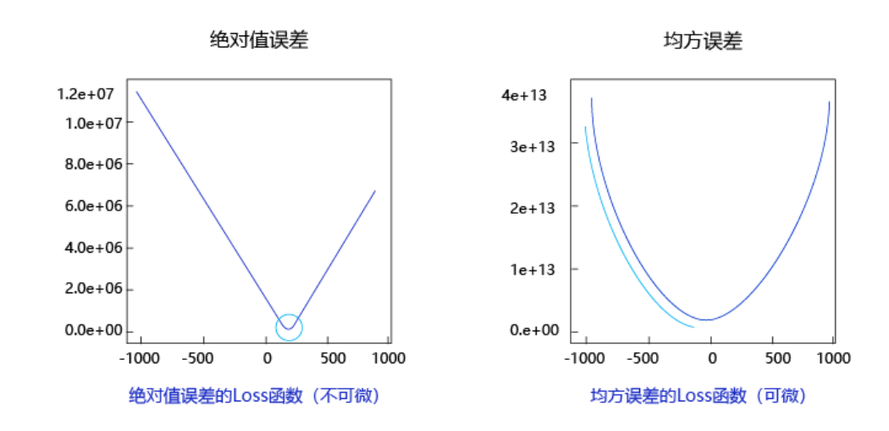
均方误差表现的“圆滑”的坡度有两个好处：
- 曲线的最低点是可导的。
- 越接近最低点，曲线的坡度逐渐放缓，有助于通过当前的梯度来判断接近最低点的程度（是否逐渐减少步长，以免错过最低点）。

#### 随机梯度下降法
- mini-batch：每次迭代时抽取出来的一批数据被称为一个mini-batch。
- batch_size：一个mini-batch所包含的样本数目称为batch_size。
- epoch：当程序迭代的时候，按mini-batch逐渐抽取出样本，当把整个数据集都遍历到了的时候，则完成了一轮训练，也叫一个epoch。启动训练时，可以将训练的轮数num_epochs和batch_size作为参数传入。


#### 归一化
特征输入归一化后，不同参数输出的Loss是一个比较规整的曲线，学习率可以设置成统一的值 ；特征输入未归一化时，不同特征对应的参数所需的步长不一致，尺度较大的参数需要大步长，尺寸较小的参数需要小步长，导致无法设置统一的学习率。

#### 预测样本数据归一化
模型学到的权重、偏置等所有参数，都是基于这个"归一化世界"的数据特性得到的，模型根本不认识原始尺度下的数据，它只认识那个经过变换后的"归一化版本"。

#### 预测时的样本需归一化，为什么使用训练样本的均值和极值计算
每个批次的数据都有自己的均值和方差。如果分别归一化，那么不同批次的数据就会被映射到完全不同的尺度上。

- 例子：训练时，我们把“房屋面积”的 [100, 500] 平方米映射到 [0, 1]。

- 预测时，来了一个新样本，面积是 600 平方米。如果用这个样本自己的值归一化（假设只有一个样本，min=max=600），它会被归一化成 0（或NaN）。这显然毫无意义。

- 更合理的做法是，用训练集的规则 min_train=100, max_train=500 来处理它。对于 600，它会变成 (600-100)/(500-100) = 1.25。这告诉模型：“这个样本超出了我们训练时见过的范围，是一个异常大的值。” 模型会根据它在训练集边界学到的模式进行外推。

即使遇到超出范围的值，我们仍然坚持使用训练集的归一化参数，因为：保持数据变换的一致性和如实反映该样本相对于训练数据的"异常"程度

#### 当部分参数的梯度计算为0是否意味着完成训练？
如果曲线有多个波谷，可能学习到的不是最低的那个波谷

#### 反向计算梯度
下一次计算依赖前一次的梯度的计算结果

#### 微积分的链式法则


```
import numpy as np

class Network(object):
    def __init__(self, num_of_weights):
        # 随机产生w的初始值
        # 为了保持程序每次运行结果的一致性，此处设置固定的随机数种子
        #np.random.seed(0)
        self.w = np.random.randn(num_of_weights, 1)
        self.b = 0.
        
    def forward(self, x):
        z = np.dot(x, self.w) + self.b
        return z
    
    def loss(self, z, y):
        error = z - y
        num_samples = error.shape[0]
        cost = error * error
        cost = np.sum(cost) / num_samples
        return cost
    
    def gradient(self, x, y):
        z = self.forward(x)
        N = x.shape[0]
        gradient_w = 1. / N * np.sum((z-y) * x, axis=0)
        gradient_w = gradient_w[:, np.newaxis]
        gradient_b = 1. / N * np.sum(z-y)
        return gradient_w, gradient_b
    
    def update(self, gradient_w, gradient_b, eta = 0.01):
        self.w = self.w - eta * gradient_w
        self.b = self.b - eta * gradient_b
            
                
    def train(self, training_data, num_epochs, batch_size=10, eta=0.01):
        n = len(training_data)
        losses = []
        for epoch_id in range(num_epochs):
            # 在每轮迭代开始之前，将训练数据的顺序随机打乱
            # 然后再按每次取batch_size条数据的方式取出
            np.random.shuffle(training_data)
            # 将训练数据进行拆分，每个mini_batch包含batch_size条的数据
            mini_batches = [training_data[k:k+batch_size] for k in range(0, n, batch_size)]
            for iter_id, mini_batch in enumerate(mini_batches):
                #print(self.w.shape)
                #print(self.b)
                x = mini_batch[:, :-1]
                y = mini_batch[:, -1:]
                a = self.forward(x)
                loss = self.loss(a, y)
                gradient_w, gradient_b = self.gradient(x, y)
                self.update(gradient_w, gradient_b, eta)
                losses.append(loss)
                print('Epoch {:3d} / iter {:3d}, loss = {:.4f}'.
                                 format(epoch_id, iter_id, loss))
        
        return losses

# 获取数据
train_data, test_data = load_data()

# 创建网络
net = Network(13)
# 启动训练
losses = net.train(train_data, num_epochs=50, batch_size=100, eta=0.1)

# 画出损失函数的变化趋势
plot_x = np.arange(len(losses))
plot_y = np.array(losses)
plt.plot(plot_x, plot_y)
plt.show()


--------------------------------------------------------------------------------

//假设第一次：w = 1，斜率-10

//更新一次：w = 1 - 0.01*（-10） = 1.1，此时斜率-9

//再更新一次：w = 1.1 - 0.01*（-9） = 1.19，此时斜率-8 

pytorch实现

import torch
import torch.nn as nn
import torch.optim as optim

# 1. 准备数据（转为张量）
# 输入：面积、卧室、房龄
X = torch.tensor([[80.0, 2.0, 5.0],   # 样本1
                  [120.0, 3.0, 2.0],  # 样本2
                  [60.0, 1.0, 10.0]], # 样本3
                 dtype=torch.float32)
# 真实房价（目标值）
y = torch.tensor([[400.0], [650.0], [250.0]], dtype=torch.float32)

# 2. 建立神经网络（其实就是定义公式里的 w 和 b）
# 这里我们定义一个“线性层”，输入3个特征，输出1个房价
model = nn.Linear(3, 1)  # 系统会随机初始化 w1,w2,w3 和 b

# 3. 定义“损失函数”和“优化器”
# 损失函数：计算预测值和真实值差了多少（均方误差）
criterion = nn.MSELoss()
# 优化器：负责下山（梯度下降），学习率设为 0.001
optimizer = optim.SGD(model.parameters(), lr=0.001)

# 4. 开始循环训练（就是蒙眼下山的过程）
for epoch in range(1000):  # 把这三条数据反复看1000遍
    # 前向传播：用当前的 w,b 算一次预测值
    predictions = model(X)
    
    # 计算损失（预测值 vs 真实值）
    loss = criterion(predictions, y)
    
    # 反向传播：根据损失，计算出每个 w 应该调大还是调小
    optimizer.zero_grad()  # 先清零上次的梯度
    loss.backward()        # 反向传播，算出梯度（坡度）
    
    # 优化器执行：根据坡度，微调 w1, w2, w3, b
    optimizer.step()
    
    # 每100次打印一下损失值（看误差是否在下降）
    if epoch % 100 == 0:
        print(f'第{epoch}次, 损失值: {loss.item():.4f}')

# 5. 训练完成，看看模型学到了什么
print("训练后的权重 w:", model.weight.data)
print("训练后的偏置 b:", model.bias.data)

# 6. 做个预测：一套 90平米、2卧室、房龄3年的房子
new_house = torch.tensor([[90.0, 2.0, 3.0]])
price = model(new_house)
print(f"预测房价为: {price.item():.2f} 万")


```


**飞浆实现**

```
class Regressor(paddle.nn.Layer):

    # self代表类的实例自身
    def __init__(self):
        # 初始化父类中的一些参数
        super(Regressor, self).__init__()
        
        # 定义一层全连接层，输入维度是13，输出维度是1
        self.fc = Linear(in_features=13, out_features=1)
    
    # 网络的前向计算
    def forward(self, inputs):
        x = self.fc(inputs)
        return x


# 声明定义好的线性回归模型
model = Regressor()
# 开启模型训练模式
model.train()
# 加载数据
training_data, test_data = load_data()
# 定义优化算法，使用随机梯度下降SGD
# 学习率设置为0.01
opt = paddle.optimizer.SGD(learning_rate=0.01, parameters=model.parameters())


EPOCH_NUM = 10   # 设置外层循环次数
BATCH_SIZE = 10  # 设置batch大小

# 定义外层循环
for epoch_id in range(EPOCH_NUM):
    # 在每轮迭代开始之前，将训练数据的顺序随机的打乱
    np.random.shuffle(training_data)
    # 将训练数据进行拆分，每个batch包含10条数据
    mini_batches = [training_data[k:k+BATCH_SIZE] for k in range(0, len(training_data), BATCH_SIZE)]
    # 定义内层循环
    for iter_id, mini_batch in enumerate(mini_batches):
        x = np.array(mini_batch[:, :-1]) # 获得当前批次训练数据
        y = np.array(mini_batch[:, -1:]) # 获得当前批次训练标签（真实房价）
        # 将numpy数据转为飞桨动态图tensor的格式
        house_features = paddle.to_tensor(x)
        prices = paddle.to_tensor(y)
        
        # 前向计算
        predicts = model(house_features)
        
        # 计算损失
        loss = F.square_error_cost(predicts, label=prices)
        avg_loss = paddle.mean(loss)
        if iter_id%20==0:
            print("epoch: {}, iter: {}, loss is: {}".format(epoch_id, iter_id, avg_loss.numpy()))
        
        # 反向传播，计算每层参数的梯度值
        avg_loss.backward()
        # 更新参数，根据设置好的学习率迭代一步
        opt.step()
        # 清空梯度变量，以备下一轮计算
        opt.clear_grad()

```


## 三、手写数字识别模型

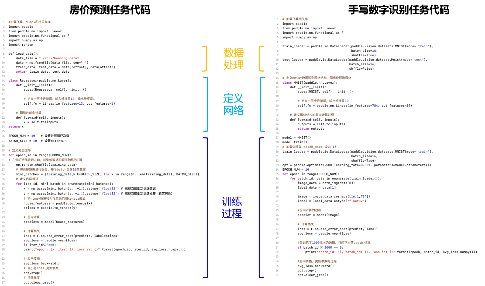

假设使用飞桨完成房价预测模型任务的流程一致，飞桨完成手写数字识别模型任务的代码结构如图所示。

```
#数据处理部分之后的代码，数据读取的部分调用Load_data函数
# 定义网络结构，同上一节所使用的网络结构
class MNIST(paddle.nn.Layer):
    def __init__(self):
        super(MNIST, self).__init__()
        # 定义一层全连接层，输出维度是1
        self.fc = paddle.nn.Linear(in_features=784, out_features=1)

    def forward(self, inputs):
        outputs = self.fc(inputs)
        return outputs

# 训练配置，并启动训练过程
def train(model):
    model = MNIST()
    model.train()
    #调用加载数据的函数
    train_loader = load_data('train')
    opt = paddle.optimizer.SGD(learning_rate=0.001, parameters=model.parameters())
    EPOCH_NUM = 10
    for epoch_id in range(EPOCH_NUM):
        for batch_id, data in enumerate(train_loader()):
            #准备数据，变得更加简洁
            images, labels = data
            images = paddle.to_tensor(images)
            labels = paddle.to_tensor(labels) 

            #前向计算的过程
            predits = model(images)
            
            #计算损失，取一个批次样本损失的平均值
            loss = F.square_error_cost(predits, labels)
            avg_loss = paddle.mean(loss)      
            
            #每训练了200批次的数据，打印下当前Loss的情况
            if batch_id % 200 == 0:
                print("epoch: {}, batch: {}, loss is: {}".format(epoch_id, batch_id, avg_loss.numpy()))
            
            #后向传播，更新参数的过程
            avg_loss.backward()
            opt.step()
            opt.clear_grad()

    # 保存模型
    paddle.save(model.state_dict(), './mnist.pdparams')
# 创建模型           
model = MNIST()
# 启动训练过程
train(model)

```

使用与房价预测相同的简单神经网络解决手写数字识别问题，但是效果并不理想。原因是手写数字识别的输入是28 × 28的像素值，输出是0-9的数字标签，而
线性回归模型无法捕捉二维图像数据中蕴含的复杂信息

训练过程（梯度下降完全一致）

训练时，和房价预测一模一样：

1. **前向传播**：输入一张"5"的图片（784个像素），用当前的 $W$ 和 $b$ 算出10个分数。

2. **计算损失**：把第5个位置的分数（对应数字5）和真实值对比（通过Softmax+交叉熵），发现预测得不准，得到一个损失值（比如2.3）。

3. **反向传播**：计算损失值对 $W$ 和 $b$ 的偏导数（梯度）。

4. **更新参数**：
   $$
   W_{\text{新}} = W_{\text{旧}} - \text{学习率} \times \text{梯度}, \quad b_{\text{新}} = b_{\text{旧}} - \text{学习率} \times \text{梯度}.
   $$

循环几千上万次，$W$ 和 $b$ 就"收敛"了（也就是训练好了）。

## 3.1 经典的全连接神经网络
经典的全连接神经网络来包含四层网络：输入层、两个隐含层和输出层，将手写数字识别任务通过全连接神经网络表示，如图所示。
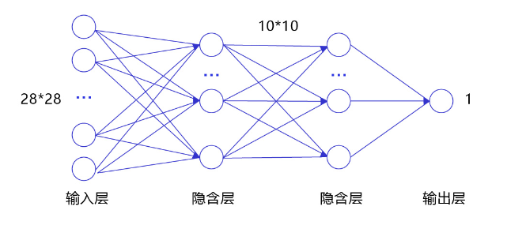


- 输入层：将数据输入给神经网络。在该任务中，输入层的尺度为28×28的像素值。
- 隐含层：增加网络深度和复杂度，隐含层的节点数是可以调整的，节点数越多，神经网络表示能力越强，参数量也会增加。在该任务中，中间的两个隐含层为10×10的- 结构，通常隐含层会比输入层的尺寸小，以便对关键信息做抽象，激活函数使用常见的Sigmoid函数。
- 输出层：输出网络计算结果，输出层的节点数是固定的。如果是回归问题，节点数量为需要回归的数字数量。如果是分类问题，则是分类标签的数量。在该任务中，模型的输出是回归一个数字，输出层的尺寸为1。

- 说明：
隐含层引入非线性激活函数 Sigmoid 是为了增加神经网络的非线性能力。

举例来说，如果一个神经网络采用线性变换，有四个输入 $x_1, x_2, x_3, x_4$，假设第一层的变换是：$z_1 = x_1 - x_2$和$z_2 = x_3 + x_4$
第二层的变换是：$y = z_1 + z_2$则将两层的变换展开后得到：$y = x_1 - x_2 + x_3 + x_4$也就是说，无论中间累积了多少层线性变换，原始输入和最终输出之间依然是线性关系。

Sigmoid是早期神经网络模型中常见的非线性变换函数，通过如下代码，绘制出Sigmoid的函数曲线。

```
def sigmoid(x):
    # 直接返回sigmoid函数
    return 1. / (1. + np.exp(-x))
 
# param:起点，终点，间距
x = np.arange(-8, 8, 0.2)
y = sigmoid(x)
plt.plot(x, y)
plt.show()
```


针对手写数字识别的任务，网络层的设计如下：
输入层的尺度为28×28，但批次计算的时候会统一加1个维度（大小为batch size）。
中间的两个隐含层为10×10的结构，激活函数使用常见的Sigmoid函数。
与房价预测模型一样，模型的输出是回归一个数字，输出层的尺寸设置成1。
下述代码为经典全连接神经网络的实现。完成网络结构定义后，即可训练神经网络。

```
import paddle.nn.functional as F
from paddle.nn import Linear

# 定义多层全连接神经网络
class MNIST(paddle.nn.Layer):
    def __init__(self):
        super(MNIST, self).__init__()
        # 定义两层全连接隐含层，输出维度是10，当前设定隐含节点数为10，可根据任务调整
        self.fc1 = Linear(in_features=784, out_features=10)
        self.fc2 = Linear(in_features=10, out_features=10)
        # 定义一层全连接输出层，输出维度是1
        self.fc3 = Linear(in_features=10, out_features=1)
    
    # 定义网络的前向计算，隐含层激活函数为sigmoid，输出层不使用激活函数
    def forward(self, inputs):
        # inputs = paddle.reshape(inputs, [inputs.shape[0], 784])
        outputs1 = self.fc1(inputs)
        outputs1 = F.sigmoid(outputs1)
        outputs2 = self.fc2(outputs1)
        outputs2 = F.sigmoid(outputs2)
        outputs_final = self.fc3(outputs2)
        return outputs_final
```

## 3.2 卷积神经网络

虽然使用经典的全连接神经网络可以提升一定的准确率，但其输入数据的形式导致丢失了图像像素间的空间信息，这影响了网络对图像内容的理解。对于计算机视觉问题，效果最好的模型仍然是卷积神经网络。卷积神经网络针对视觉问题的特点进行了网络结构优化，可以直接处理原始形式的图像数据，保留像素间的空间信息，因此更适合处理视觉问题。

卷积神经网络由多个卷积层和池化层组成，如图所示。卷积层负责对输入进行扫描以生成更抽象的特征表示，池化层对这些特征表示进行过滤，保留最关键的特征信息。
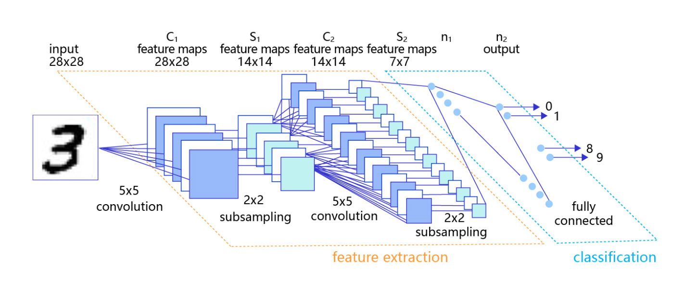


## 3.3 分类任务的损失函数

损失函数是模型优化的目标，用于在众多的参数取值中，识别最理想的取值。损失函数的计算在训练过程的代码中，每一轮模型训练的过程都相同，分如下三步：
- 先根据输入数据正向计算预测输出。
- 再根据预测值和真实值计算损失。
- 最后根据损失反向传播梯度并更新参数。

在之前的方案中，我们复用了房价预测模型的损失函数-均方误差。从预测效果来看，虽然损失不断下降，模型的预测值逐渐逼近真实值，但模型的最终效果不够理想。究其根本，不同的深度学习任务需要有各自适宜的损失函数。我们以房价预测和手写数字识别两个任务为例，详细剖析其中的缘由如下：

房价预测是回归任务，而手写数字识别是分类任务，使用均方误差作为分类任务的损失函数存在逻辑和效果上的缺欠。
房价可以是大于0的任何浮点数，而手写数字识别的输出只可能是0~9之间的10个整数，相当于一种标签。
在房价预测的案例中，由于房价本身是一个连续的实数值，因此以模型输出的数值和真实房价差距作为损失函数（Loss）是符合道理的。但对于分类问题，真实结果是分类标签，而模型输出是实数值，导致以两者相减作为损失不具备物理含义。

**Softmax函数**

如果模型能输出10个标签的概率，对应真实标签的概率输出尽可能接近100%，而其他标签的概率输出尽可能接近0%，且所有输出概率之和为1。这是一种更合理的假设！与此对应，真实的标签值可以转变成一个10维度的one-hot向量，在对应数字的位置上为1，其余位置为0，比如标签“6”可以转变成[0,0,0,0,0,0,1,0,0,0]。

为了实现上述思路，需要引入Softmax函数，它可以将原始输出转变成对应标签的概率，公式如下，其中C是标签类别个数。

$$
\text{softmax}(x_i) = \frac{e^{x_i}}{\sum_{j=0}^{C-1} e^{x_j}}, \quad i = 0, 1, ..., C-1
$$
从公式的形式可见，每个输出的范围均在0~1之间，且所有输出之和等于1，这是这种变换后可被解释成概率的基本前提。对应到代码上，需要在前向计算中，对全连接网络的输出层增加一个Softmax运算，outputs = F.softmax(outputs)。

图是一个三个标签的分类模型（三分类）使用的Softmax输出层，从中可见原始输出的三个数字3、1、-3，经过Softmax层后转变成加和为1的三个概率值0.88、0.12、0。

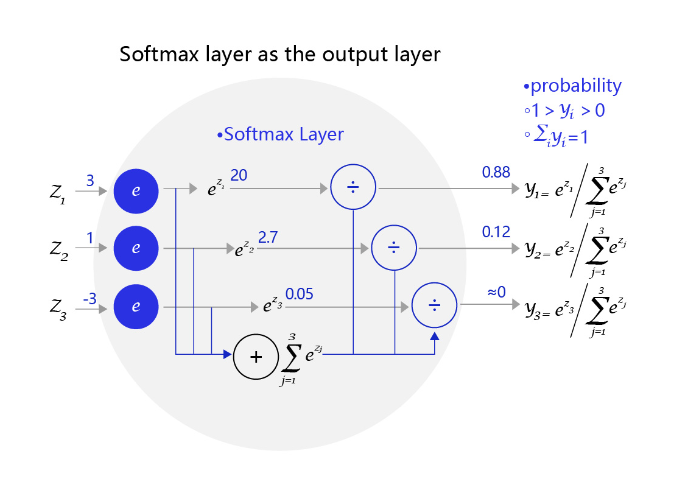
上文解释了为何让分类模型的输出拟合概率的原因，但为何偏偏用Softmax函数完成这个职能？ 下面以二分类问题（只输出两个标签）进行原理的探讨。

对于二分类问题，使用两个输出接入Softmax作为输出层，等价于使用单一输出接入Sigmoid函数。如 图4 所示，利用两个标签的输出概率之和为1的条件，Softmax输出0.6和0.4两个标签概率，从数学上等价于输出一个标签的概率0.6。

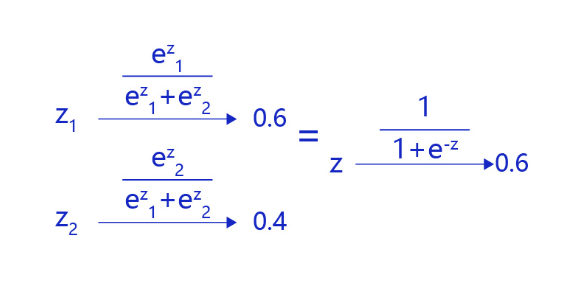

在这种情况下，只有一层的模型为 $S(w^T x_i)$，$S$ 为 Sigmoid 函数。模型预测为 1 的概率为 $S(w^T x_i)$，模型预测为 0 的概率为 $1 - S(w^T x_i)$。


## 3.3 交叉熵
在模型输出为分类标签的概率时，直接以标签和概率做比较也不够合理，人们更习惯使用交叉熵误差作为分类问题的损失衡量。交叉熵损失函数的设计是基于最大似然思想：最大概率得到观察结果的假设是真的。


常见的分类任务模型图

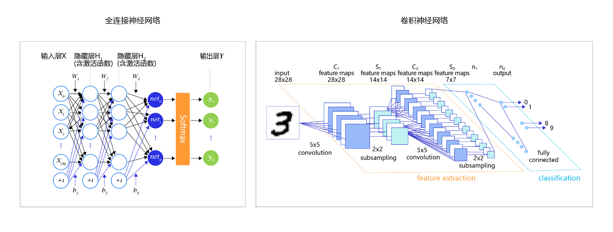


```
# 定义 SimpleNet 网络结构
import paddle
from paddle.nn import Conv2D, MaxPool2D, Linear
import paddle.nn.functional as F
# 多层卷积神经网络实现
class MNIST(paddle.nn.Layer):
     def __init__(self):
         super(MNIST, self).__init__()
         
         # 定义卷积层，输出特征通道out_channels设置为20，卷积核的大小kernel_size为5，卷积步长stride=1，padding=2
         self.conv1 = Conv2D(in_channels=1, out_channels=20, kernel_size=5, stride=1, padding=2)
         # 定义池化层，池化核的大小kernel_size为2，池化步长为2
         self.max_pool1 = MaxPool2D(kernel_size=2, stride=2)
         # 定义卷积层，输出特征通道out_channels设置为20，卷积核的大小kernel_size为5，卷积步长stride=1，padding=2
         self.conv2 = Conv2D(in_channels=20, out_channels=20, kernel_size=5, stride=1, padding=2)
         # 定义池化层，池化核的大小kernel_size为2，池化步长为2
         self.max_pool2 = MaxPool2D(kernel_size=2, stride=2)
         # 定义一层全连接层，输出维度是1
         self.fc = Linear(in_features=980, out_features=1)
         
    # 定义网络前向计算过程，卷积后紧接着使用池化层，最后使用全连接层计算最终输出
    # 卷积层激活函数使用Relu，全连接层不使用激活函数
     def forward(self, inputs):
         x = self.conv1(inputs)
         x = F.relu(x)
         x = self.max_pool1(x)
         x = self.conv2(x)
         x = F.relu(x)
         x = self.max_pool2(x)
         x = paddle.reshape(x, [x.shape[0], -1])
         x = self.fc(x)
         return x


def evaluation(model, datasets):
    model.eval()

    acc_set = list()
    for batch_id, data in enumerate(datasets()):
        images, labels = data
        images = paddle.to_tensor(images)
        labels = paddle.to_tensor(labels)
        pred = model(images)   # 获取预测值
        acc = paddle.metric.accuracy(input=pred, label=labels)
        acc_set.extend(acc.numpy())
    
    # #计算多个batch的准确率
    acc_val_mean = np.array(acc_set).mean()
    return acc_val_mean

#仅修改计算损失的函数，从均方误差（常用于回归问题）到交叉熵误差（常用于分类问题）
def train(model):
    model.train()
    #调用加载数据的函数
    # train_loader = load_data('train')
    # val_loader = load_data('valid')
    opt = paddle.optimizer.SGD(learning_rate=0.01, parameters=model.parameters())
    EPOCH_NUM = 10
    for epoch_id in range(EPOCH_NUM):
        for batch_id, data in enumerate(train_loader()):
            #准备数据
            images, labels = data
            images = paddle.to_tensor(images)
            labels = paddle.to_tensor(labels)
            #前向计算的过程
            predicts = model(images)
            
            #计算损失，使用交叉熵损失函数，取一个批次样本损失的平均值
            loss = F.cross_entropy(predicts, labels)
            avg_loss = paddle.mean(loss)
            
            #每训练了200批次的数据，打印下当前Loss的情况
            if batch_id % 200 == 0:
                print("epoch: {}, batch: {}, loss is: {}".format(epoch_id, batch_id, avg_loss.numpy()))
            
            #后向传播，更新参数的过程
            avg_loss.backward()
            # 最小化loss,更新参数
            opt.step()
            # 清除梯度
            opt.clear_grad()
        # acc_train_mean = evaluation(model, train_loader)
        # acc_val_mean = evaluation(model, val_loader)
        # print('train_acc: {}, val acc: {}'.format(acc_train_mean, acc_val_mean))   
    #保存模型参数
    paddle.save(model.state_dict(), 'mnist.pdparams')

#创建模型    
model = MNIST()
#启动训练过程
train(model)


# 读取一张本地的样例图片，转变成模型输入的格式
def load_image(img_path):
    # 从img_path中读取图像，并转为灰度图
    im = Image.open(img_path).convert('L')
    im = im.resize((28, 28), Image.ANTIALIAS)
    im = np.array(im).reshape(1, 1, 28, 28).astype(np.float32)
    # 图像归一化
    im = 1.0 - im / 255.
    return im

# 定义预测过程
model = MNIST()
params_file_path = 'mnist.pdparams'
img_path = 'work/example_0.jpg'
# 加载模型参数
param_dict = paddle.load(params_file_path)
model.load_dict(param_dict)
# 灌入数据
model.eval()
tensor_img = load_image(img_path)
print(tensor_img.shape)
#模型反馈10个分类标签的对应概率
results = model(paddle.to_tensor(tensor_img))
#取概率最大的标签作为预测输出
lab = np.argsort(results.numpy())
print("本次预测的数字是: ", lab[0][-1])
```


## 3.4 优化算法

### 3.4.1 设置学习率

在深度学习神经网络模型中，通常使用标准的随机梯度下降算法更新参数，学习率代表参数更新幅度的大小，即步长。当学习率最优时，模型的有效容量最大，最终能达到的效果最好。学习率和深度学习任务类型有关，合适的学习率往往需要大量的实验和调参经验。探索学习率最优值时需要注意如下两点：

**学习率不是越小越好**。学习率越小，损失函数的变化速度越慢，意味着我们需要花费更长的时间进行收敛，如 图2 左图所示。
**学习率不是越大越好**。只根据总样本集中的一个批次计算梯度，抽样误差会导致计算出的梯度不是全局最优的方向，且存在波动。在接近最优解时，过大的学习率会导致参数在最优解附近震荡，损失难以收敛，如图所示。

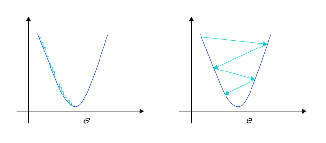


在训练前，我们往往不清楚一个特定问题设置成怎样的学习率是合理的，因此在训练时可以尝试调小或调大，通过观察Loss下降的情况判断合理的学习率。

### 3.4.2 学习率的主流优化算法

学习率是优化器的一个参数，调整学习率看似是一件非常麻烦的事情，需要不断的调整步长，观察训练时间和Loss的变化。经过研究员的不断的实验，当前已经形成了四种比较成熟的优化算法：SGD、Momentum、AdaGrad和Adam

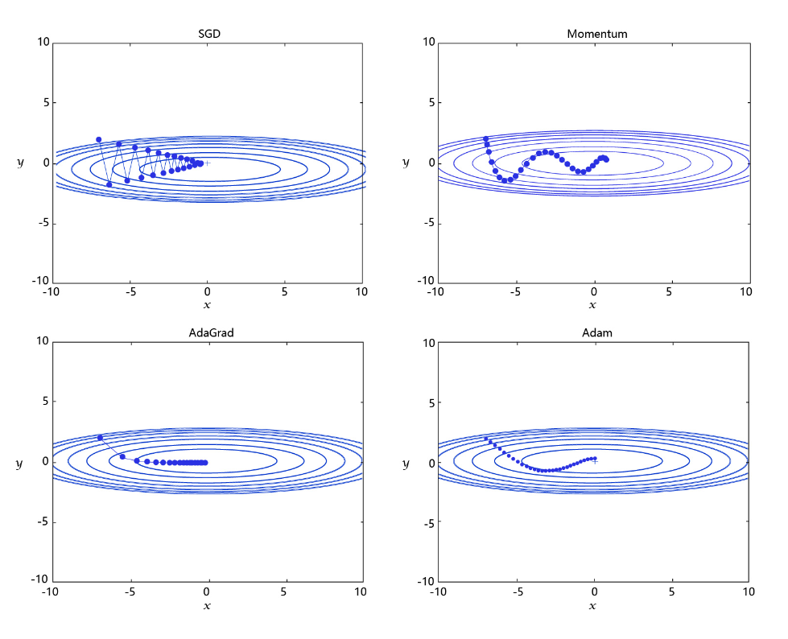

- SGD： 随机梯度下降算法，每次训练少量数据，抽样偏差导致的参数收敛过程中震荡。

- Momentum： 引入物理“动量”的概念，累积速度，减少震荡，使参数更新的方向更稳定。
每个批次的数据含有抽样误差，导致梯度更新的方向波动较大。如果我们引入物理动量的概念，给梯度下降的过程加入一定的“惯性”累积，就可以减少更新路径上的震荡，即每次更新的梯度由“历史多次梯度的累积方向”和“当次梯度”加权相加得到。历史多次梯度的累积方向往往是从全局视角更正确的方向，这与“惯性”的物理概念很像，也是为何其起名为“Momentum”的原因。类似不同品牌和材质的篮球有一定的重量差别，街头篮球队中的投手（擅长中远距离投篮）喜欢稍重篮球的比例较高。一个很重要的原因是，重的篮球惯性大，更不容易受到手势的小幅变形或风吹的影响。

- AdaGrad： 根据不同参数距离最优解的远近，动态调整学习率。学习率逐渐下降，依据各参数变化大小调整学习率。
通过调整学习率的实验可以发现：当某个参数的现值距离最优解较远时（表现为梯度的绝对值较大），我们期望参数更新的步长大一些，以便更快收敛到最优解。当某个参数的现值距离最优解较近时（表现为梯度的绝对值较小），我们期望参数的更新步长小一些，以便更精细的逼近最优解。类似于打高尔夫球，专业运动员第一杆开球时，通常会大力打一个远球，让球尽量落在洞口附近。当第二杆面对离洞口较近的球时，他会更轻柔而细致的推杆，避免将球打飞。与此类似，参数更新的步长应该随着优化过程逐渐减少，减少的程度与当前梯度的大小有关。根据这个思想编写的优化算法称为“AdaGrad”，Ada是Adaptive的缩写，表示“适应环境而变化”的意思。RMSProp是在AdaGrad基础上的改进，学习率随着梯度变化而适应，解决AdaGrad学习率急剧下降的问题。

- Adam： 由于动量和自适应学习率两个优化思路是正交的，因此可以将两个思路结合起来，这就是当前广泛应用的算法。

# 四、计算机视觉

# 4.1、卷积神经网络

卷积神经网络：卷积神经网络（Convolutional Neural Networks, CNN）是计算机视觉技术最经典的模型结构。本教程主要介绍卷积神经网络的常用模块，包括：卷积、池化、激活函数、批归一化、丢弃法等。

**图像分类**：介绍图像分类算法的经典模型结构，包括：LeNet、AlexNet、VGG、GoogLeNet、ResNet，并通过眼疾筛查的案例展示算法的应用。

**目标检测**：介绍目标检测YOLOv3算法，并通过林业病虫害检测案例展示YOLOv3算法的应用。

(a) Image Classification： 图像分类，用于识别图像中物体的类别（如：bottle、cup、cube）。

(b) Object Localization： 目标检测，用于检测图像中每个物体的类别，并准确标出它们的位置。

(c) Semantic Segmentation： 图像语义分割，用于标出图像中每个像素点所属的类别，属于同一类别的像素点用一个颜色标识。

(d) Instance Segmentation： 实例分割，值得注意的是，（b）中的目标检测任务只需要标注出物体位置，而（d）中的实例分割任务不仅要标注出物体位置，还需要标注出物体的外形轮廓。


### 4.1.1 卷积

卷积核（kernel）也被叫做滤波器（filter），假设卷积核的高和宽分别为 $k_h$ 和 $k_w$，则称称为 $k_h \times k_w$ 卷积，比如3 × 5卷积，就是指卷积核的高为3，宽为5。


在卷积神经网络中，一个卷积算子除了上面描述的卷积过程之外，还包括加上偏置项的操作。例如假设偏置为1，则上面卷积计算的结果为：

$$
0 \times 1 + 1 \times 2 + 2 \times 4 + 3 \times 5 + 1 = 26
$$

$$
0 \times 2 + 1 \times 3 + 2 \times 5 + 3 \times 6 + 1 = 32
$$

$$
0 \times 4 + 1 \times 5 + 2 \times 7 + 3 \times 8 + 1 = 44
$$

$$
0 \times 5 + 1 \times 6 + 2 \times 8 + 3 \times 9 + 1 = 50
$$

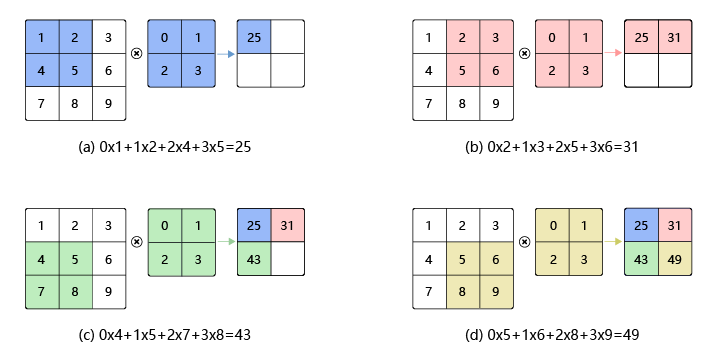

### 4.1.2 填充（padding）

如果经过多次卷积，输出图片尺寸会不断减小。为了避免卷积之后图片尺寸变小，通常会在图片的外围进行填充(padding)

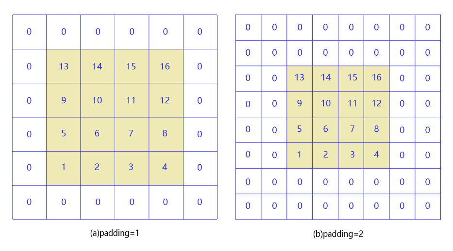

### 4.1.3 步幅（stride）
步幅为2的卷积过程，卷积核在图片上移动时，每次移动大小为2个像素点
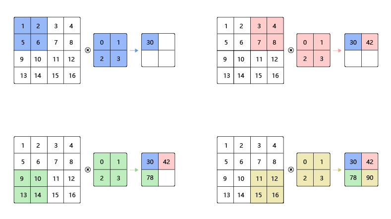

### 4.1.4 感受野（Receptive Field）

输出特征图上每个点的数值，直接输入到上式为 $k_{ij} \times k_{iu}$ 的区域内的元素与对应区域内的感受野大小就是 $3 \times 3$

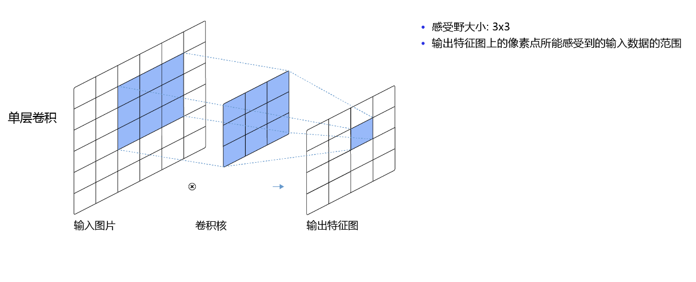

而当通过两层 $3 \times 3$ 的卷积之后，感受野的大小将会增加到 $5 \times 5$

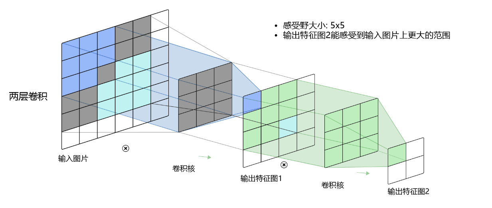
因此，当增加卷积网络深度的同时，感受野将会增大，输出特征图中的一个像素点将会包含更多的图像语义信息。

### 4.1.5 池化（Pooling）

池化是使用某一位置的相邻输出的总体统计特征代替网络在该位置的输出，其好处是当输入数据做出少量平移时，经过池化函数后的大多数输出还能保持不变。比如：当识别一张图像是否是人脸时，我们需要知道人脸左边有一只眼睛，右边也有一只眼睛，而不需要知道眼睛的精确位置，这时候通过池化某一片区域的像素点来得到总体统计特征会显得很有用。由于池化之后特征图会变得更小，如果后面连接的是全连接层，能有效的减小神经元的个数，节省存储空间并提高计算效率。如图所示，将一个$2 \times 2$的区域池化成一个像素点。通常有两种方法，平均池化和最大池化。

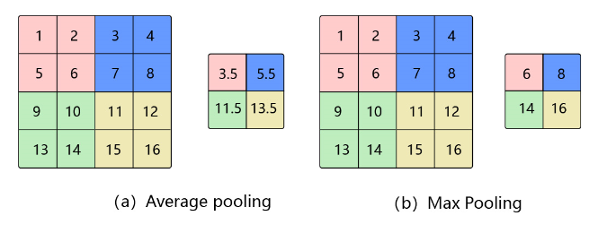
- 如图15（a）：平均池化。这里使用大小为 $2 \times 2$ 的池化窗口，每次移动的步幅为2，对池化窗口覆盖区域内的像素取平均值，得到相应的输出特征图的像素值。

- 如图15（b）：最大池化。对池化窗口覆盖区域内的像素取最大值，得到输出特征图的像素值。当池化窗口在图片上滑动时，会得到张量输出特征图。池化窗口的大小称为池化大小，用 $k_h \times k_w$ 表示。在卷积神经网络中用的比较多的层是窗口大小为 $2 \times 2$，步幅为2的池化。

### 4.1.6 ReLU激活函数

前面介绍的网络结构中，普遍使用Sigmoid函数做激活函数。在神经网络发展的早期，Sigmoid函数用的比较多，而目前用的较多的激活函数是ReLU。这是因为Sigmoid函数在反向传播过程中，容易造成梯度的衰减

Sigmoid和ReLU函数的曲线图：

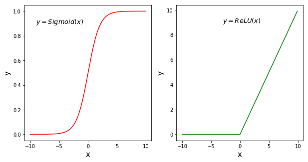

从上面的函数曲线可以看出，当x为较大的正数的时候，Sigmoid函数数值非常接近于1，函数曲线变得很平滑，在这些区域Sigmoid函数的导数接近于零。当
x为较小的负数时，Sigmoid函数值也非常接近于0，函数曲线也很平滑，在这些区域Sigmoid函数的导数也接近于0。只有当x的取值在0附近时，Sigmoid函数的导数才比较大

由于最开始是将神经网络的参数随机初始化的，$z$ 的取值很有可能在很大或者很小的区域，这些地方都可能造成 Sigmoid 函数的导数接近于 0，导致 $z$ 的梯度接近于 0；即使 $z$ 取值在接近于 0 的地方，按上面的分析，经过 Sigmoid 函数反向传播之后，$z$ 的梯度不超过 $y$ 的梯度的 $\frac{1}{4}$，如果有多层网络使用了 Sigmoid 激活函数，则比较靠后的那些层梯度将衰减到非常小的值。

ReLU 函数则不同，虽然在 $z < 0$ 的地方，ReLU 函数的导数为 0，但是在 $z > 0$ 的地方，ReLU 函数的导数为 1，能够将 $y$ 的梯度完整的传递给 $z$，而不会引起梯度消失。

### 4.1.7 丢弃法（Dropout）
丢弃法（Dropout）是深度学习中一种常用的抑制过拟合的方法，其做法是在神经网络学习过程中，随机删除一部分神经元。训练时，随机选出一部分神经元，将其输出设置为0，这些神经元将不对外传递信号。

图是Dropout示意图，左边是完整的神经网络，右边是应用了Dropout之后的网络结构。应用Dropout之后，会将标了×的神经元从网络中删除，让它们不向后面的层传递信号。在学习过程中，丢弃哪些神经元是随机决定，因此模型不会过度依赖某些神经元，能一定程度上抑制过拟合。

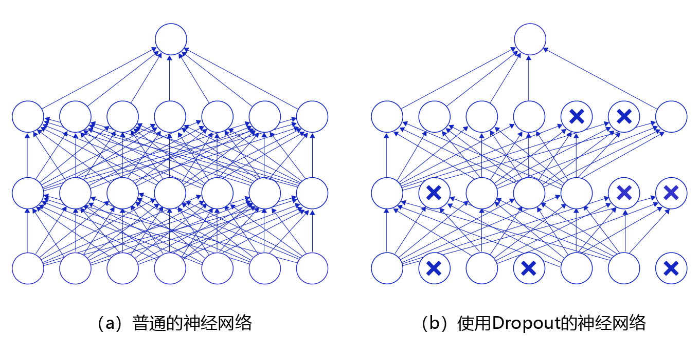

## 4.2、图像分类

图像分类是根据图像的语义信息对不同类别图像进行区分，是计算机视觉的核心，是物体检测、图像分割、物体跟踪、行为分析、人脸识别等其他高层次视觉任务的基础。

- LeNet：Yan LeCun等人于1998年第一次将卷积神经网络应用到图像分类任务上[1]，在手写数字识别任务上取得了巨大成功。

- AlexNet：Alex Krizhevsky等人在2012年提出了AlexNet[2], 并应用在大尺寸图片数据集ImageNet上，获得了2012年ImageNet比赛冠军(ImageNet Large Scale Visual Recognition Challenge，ILSVRC）。

- VGG：Simonyan和Zisserman于2014年提出了VGG网络结构[3]，是当前最流行的卷积神经网络之一，由于其结构简单、应用性极强而深受广大研究者欢迎。

- GoogLeNet：Christian Szegedy等人在2014提出了GoogLeNet[4]，并取得了2014年ImageNet比赛冠军。

- ResNet：Kaiming He等人在2015年提出了ResNet[5]，通过引入残差模块加深网络层数，在ImagNet数据集上的错误率降低到3.6%，超越了人眼识别水平。ResNet的设计思想深刻地影响了后来的深度神经网络的设计。

## 4.3 目标检测

### 4.3.1 边界框（bounding box）
检测任务需要同时预测物体的类别和位置，因此需要引入一些跟位置相关的概念。通常使用边界框（bounding box，bbox）来表示物体的位置，边界框是正好能包含物体的矩形框。

在检测任务中，训练数据集的标签会给出目标物体真实边界框对应的 $x_1, x_2, y_1, y_2$，这样的边界框也被称为真实框（ground truth box）。模型会对目标物体可能出现的真实位置进行预测，由模型预测出的边界框则称为预测框（prediction box）。

### 4.3.2 锚框（Anchor box）
锚框与物体边界框不同，是由人们假想出来的一种框。先设定好锚框的大小和形状，再以图像上某一个点为中心画出矩形框。在下图中，以像素点[300, 500]为中心可以使用下面的程序生成3个框，如图中蓝色框所示，其中锚框A1跟人像区域非常接近。

在目标检测任务中，通常会以某种规则在图片上生成一系列锚框，将这些锚框当成可能的候选区域。模型对这些候选区域是否包含物体进行预测，如果包含目标物体，则还需要进一步预测出物体所属的类别。还有更为重要的一点是，由于锚框位置是固定的，它不大可能刚好跟物体边界框重合，所以需要在锚框的基础上进行微调以形成能准确描述物体位置的预测框，模型需要预测出微调的幅度。在训练过程中，模型通过学习不断的调整参数，最终能学会如何判别出锚框所代表的候选区域是否包含物体，如果包含物体的话，物体属于哪个类别，以及物体边界框相对于锚框位置需要调整的幅度。

### 4.3.3 交并比
上面我们画出了以点 $(300, 500)$ 为中心，生成三个锚框，我们可以看到锚框 A1 与真实框 G 的融合度比较好。那么如何衡量真实框之间的交集关系呢？在检测任务中，使用交并比（Intersection of Union，IoU）作为衡量指标。这一概念来源于数学中的集合论，用来描述两个集合 $A$ 和 $B$ 之间的关系，它等于两个集合的交集里所包含的元素个数，除以它们的并集中元素个数。

$$
IoU = \frac{A \cap B}{A \cup B}
$$

我们将用这个概念来描述两个框之间的融合度。两个框可以看成是两个像素的集合，它们的交并比等于两个框重合部分的面积除以它们并起来的面积。下图"交集"中蓝色区域是两个框的重合部分，图中"蓝"表示交集。

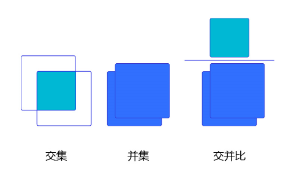

### 4.3.4 YOLOv3模型设计思想

YOLOv3算法的基本思想可以分成两部分：

- 按一定规则在图片上产生一系列的候选区域，然后根据这些候选区域与图片上物体真实框之间的位置关系对候选区域进行标注。跟真实框足够接近的那些候选区域会被标注为正样本，同时将真实框的位置作为正样本的位置目标。偏离真实框较大的那些候选区域则会被标注为负样本，负样本不需要预测位置或者类别。
- 使用卷积神经网络提取图片特征并对候选区域的位置和类别进行预测。这样每个预测框就可以看成是一个样本，根据真实框相对它的位置和类别进行了标注而获得标签值，通过网络模型预测其位置和类别，将网络预测值和标签值进行比较，就可以建立起损失函数。
YOLOv3算法训练过程的流程图如 图所示：

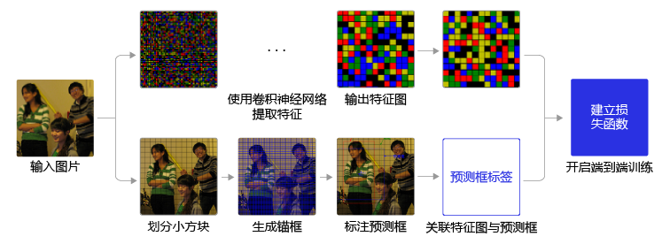

- 图左边是输入图片，上半部分所示的过程是使用卷积神经网络对图片提取特征，随着网络不断向前传播，特征图的尺寸越来越小，每个像素点会代表更加抽象的特征模式，直到输出特征图，其尺寸减小为原图的 $\frac{1}{32}$。

- 图下半部分描述了生成区域的过程。首先将原图划分成多个小块，每个小块的大小是 $32 \times 32$，然后以每个小块为中心分别生成一系列锚框，整张图片都会被锚框覆盖。在每个锚框的基础上产生一个与之对应的预测框，根据锚框和预测框与图片上物体真实框之间的位置关系，对这些预测框进行标注。

- 将上方支路中输出的特征图与下方支路中产生的预测框标签建立关联，创建损失函数，并训练到最终的训练过程。
